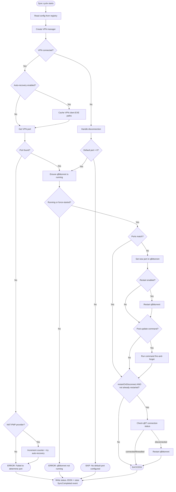
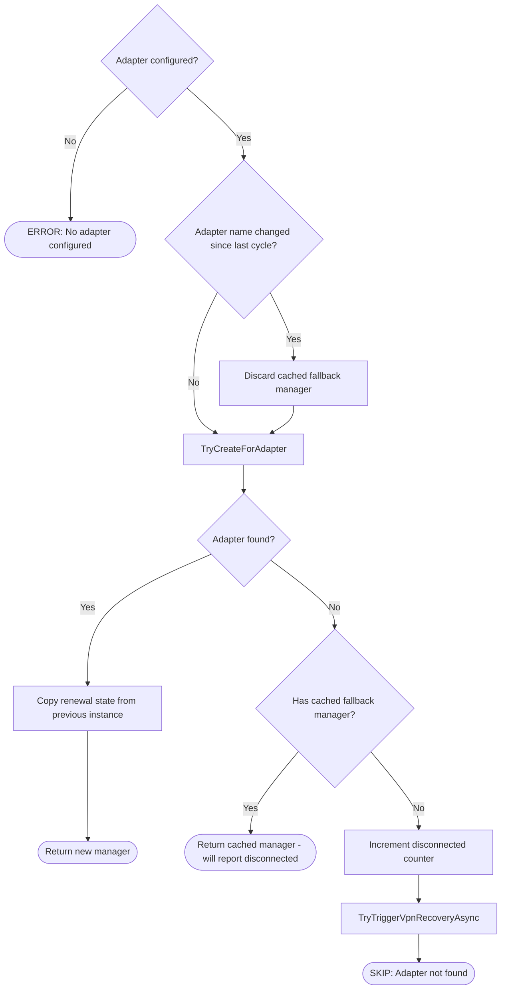

# qbPortWeaver - Sync Cycle Flow

This document describes the core port synchronization logic implemented in `PortSyncService.cs`. The sync cycle runs on a configurable interval (default 180s) and is serialized by a semaphore in `MainForm` - only one cycle runs at a time.

## High-Level Overview



## VPN Manager Creation

The sync cycle instantiates a provider-specific `IVpnManager` based on the configured VPN provider setting.

| Provider   | Manager class      | Port detection method                          |
|------------|--------------------|-------------------------------------------------|
| ProtonVPN  | `ProtonVpnManager` | Parses the ProtonVPN log file for the last assigned port |
| PIA        | `PiaVpnManager`    | Runs `piactl get portforward` and parses stdout |
| NAT-PMP    | `NatPmpManager`    | Sends a UDP port mapping request (RFC 6886) to the gateway |

Unknown provider values fall back to ProtonVPN with a warning.

### NAT-PMP Manager Creation

NAT-PMP has additional complexity because the adapter must be discovered each cycle and the manager carries renewal state between cycles.



**Why the fallback?** When a VPN reconnects, the network adapter may briefly disappear. Returning the last known `NatPmpManager` lets `IsVpnConnected()` report `false`, so the main flow handles disconnection gracefully (applies the default port or skips) instead of erroring out.

## VPN Disconnection Handling

When the VPN is detected as disconnected, the cycle increments a consecutive-disconnection counter. This counter drives two behaviors:

1. **Default port fallback** - if `DefaultPort > 0`, the cycle applies it to qBittorrent so the client remains functional (typically on a non-VPN port). If `DefaultPort == 0`, the cycle is skipped entirely.

2. **VPN auto-recovery** - if enabled, once the counter reaches the configured threshold, the cycle:
   - Resets the counter (to prevent repeated triggers)
   - Looks up the Windows service name for the VPN provider
   - Sends a restart request to the helper service (runs as SYSTEM) via named pipe
   - Restarts the VPN client process in the user session

```
Cycle 1: VPN disconnected → counter=1 (threshold=3, no action)
Cycle 2: VPN disconnected → counter=2 (threshold=3, no action)
Cycle 3: VPN disconnected → counter=3 → TRIGGER RECOVERY → counter=0
Cycle 4: VPN still down   → counter=1 (recovery in progress)
Cycle 5: VPN reconnects   → counter=0
```

### Counter Reset Rules

The counter is reset to zero at different points depending on the provider:

| Provider        | Reset point                                    | Reason |
|-----------------|------------------------------------------------|--------|
| ProtonVPN / PIA | When `IsVpnConnected()` returns `true`         | Connectivity check is sufficient |
| NAT-PMP         | After a successful port mapping (`GetVpnPortAsync`) | The gateway may respond to connectivity probes even when port mapping fails; counter stays non-zero (and may increment via `HandleNatPmpPortMappingFailureAsync`) until a mapping actually succeeds |

## qBittorrent Interaction

All qBittorrent communication goes through `QBittorrentManager`, which wraps the [qBittorrent Web API](https://github.com/qbittorrent/qBittorrent/wiki/WebUI-API-(qBittorrent-4.1)).

### Port Update Sequence

```
1. GET  /api/v2/app/preferences  → read listen_port + current_interface_name
2. POST /api/v2/app/setPreferences  → set listen_port (only if different)
3. (optional) Kill + relaunch qBittorrent process (if restart enabled)
4. (optional) Run post-update shell command
5. (optional) GET /api/v2/transfer/info → check connection_status
              If "disconnected" → kill + relaunch qBittorrent
              Skipped if step 3 already restarted (avoids redundant restart)
```

### Interface Mismatch Warning

When enabled, the cycle compares qBittorrent's bound network interface (`current_interface_name` from preferences) against the configured VPN provider name. A mismatch raises the `InterfaceMismatchDetected` event, which shows a balloon tip from the tray icon. This helps catch cases where qBittorrent is routing traffic outside the VPN tunnel.

## Status Output

Every cycle writes a JSON status file (`status.json` next to the log file) capturing the full cycle outcome. External tools can read this file to monitor sync health.

```json
{
  "appVersion": "2.4.1",
  "timestamp": "2026-03-12T10:30:00+01:00",
  "vpnProvider": "ProtonVPN",
  "vpnConnected": true,
  "vpnPort": 51234,
  "qBittorrentRunning": true,
  "qBittorrentPreviousPort": 44000,
  "qBittorrentPort": 51234,
  "portChanged": true,
  "updateIntervalSeconds": 180,
  "status": "success",
  "message": "Completed successfully"
}
```

The `status` field is one of:
- **`success`** - port synced (or already matched)
- **`error`** - something failed (VPN port unreadable, qBittorrent unreachable, etc.)
- **`skipped`** - VPN disconnected and no default port configured (no-op cycle)

## Method Call Map

```
RunAsync
 └─ RunCoreAsync
     ├─ ReadConfig
     ├─ CreateVpnManager
     │   └─ CreateNatPmpVpnManager (NAT-PMP only)
     │       ├─ BuildDisconnectedMessage
     │       └─ TryTriggerVpnRecoveryAsync
     ├─ IVpnManager.IsVpnConnected
     ├─ (if disconnected)
     │   ├─ BuildDisconnectedMessage
     │   └─ TryTriggerVpnRecoveryAsync
     ├─ (if connected)
     │   ├─ VpnAutoRecoveryManager.CacheRunningClientExePaths
     │   ├─ IVpnManager.GetVpnPortAsync
     │   └─ HandleNatPmpPortMappingFailureAsync (if port null, NAT-PMP only)
     │       ├─ BuildDisconnectedMessage
     │       └─ TryTriggerVpnRecoveryAsync
     └─ EnsureRunningAndUpdatePortAsync
         ├─ EnsureQBittorrentRunningAsync
         ├─ QBittorrentManager.GetPreferencesAsync
         ├─ CheckInterfaceMatch
         ├─ ApplyPortUpdateAsync
         │   ├─ QBittorrentManager.SetListeningPortAsync
         │   ├─ QBittorrentManager.RestartAsync
         │   └─ RunPostUpdateCommand
         ├─ CheckAndRestartIfDisconnectedAsync (skipped if already restarted)
         │   └─ QBittorrentManager.RestartAsync
         └─ SetCompleted
```
