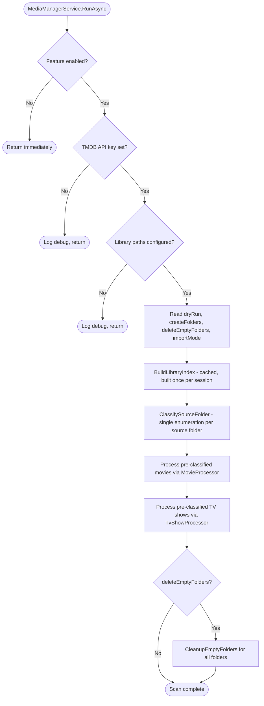

# qbPortWeaver - Media Manager

The Media Manager subsystem automatically imports movie and TV show files into Plex-compatible library folders using [Plex naming conventions](https://support.plex.tv/articles/naming-and-organizing-your-tv-show-files/), with TMDB metadata for authoritative titles and years. Files are transferred via hardlink (with automatic fallback to copy for cross-volume scenarios), copy, or move. It runs as part of the sync cycle (when enabled) or on-demand from the Media Manager dialog.

## Architecture

```
MediaManagerService          Orchestrator - single-pass source enumeration, wires processors, cleanup, UI scan/apply
  ├── MovieProcessor           Processes movie files and folders against TMDB (static lookup cache)
  ├── TvShowProcessor          Processes TV episode files against TMDB (static lookup cache)
  ├── FileImporter             File transfer (hardlink/copy/move) + library size index for duplicate detection
  ├── FileNameParser           Stateless parser - extracts titles, years, and episode info from filenames
  └── TmdbClient               HTTP client for TMDB search API (movie + TV) with rate limiting
```

`MediaManagerForm` is the WinForms dialog that drives the scan/preview/import workflow via `MediaManagerService.ScanAsync` and `ApplyProposalsAsync`.

### Recommended Folder Layout

Source folders (download/seeding folders) are scanned by both the movie and TV show processors. The movie processor skips files and subfolders that look like TV shows (`SxxExx` episodes and `Sxx` season packs), so mixing content in a single folder works well.

Optionally configure separate library folders for movies and TV shows to import files into a Plex-compatible structure:

```
Source (download/seeding):
  D:\Torrents\Downloaded\     <-- add to Source Folders

Library (optional):
  \\NAS\Media\Movies\         <-- Movies Library
  \\NAS\Media\TV Shows\       <-- TV Shows Library
```

When library paths are configured, files are imported (hardlink/copy/move) into the library while originals remain in the source folder for seeding. At least one library path (movies or TV shows) must be configured for the Media Manager to operate.

## Plex Naming Targets

| Type | With folder creation | Without folder creation |
|------|---------------------|------------------------|
| Movie | `Movies/Title (Year)/Title (Year).ext` | `Movies/Title (Year).ext` |
| Movie (multi-part) | `Movies/Title (Year)/Title (Year) - part1.ext` | `Movies/Title (Year) - part1.ext` |
| TV episode | `TV/Show (Year)/Season XX/Show (Year) - SXXEXX.ext` | `TV/Show (Year) - SXXEXX.ext` |

## Sync Cycle Flow



**Dry-run mode:** When enabled, the processors log "Would import" instead of "Importing" and skip the actual file transfer. Folder cleanup logs "Would delete" but does not check whether folders *would become* empty from simulated imports -- it only reports folders that are already empty or nfo-only on disk.

## File Name Parser

`FileNameParser` is a stateless utility that extracts structured metadata from scene, P2P, and fansub filenames. It handles movies and TV episodes through separate entry points.

### Recognised Video Extensions

`.mkv`, `.mp4`, `.avi`, `.mov`, `.wmv`, `.flv`, `.m4v`, `.mpg`, `.mpeg`, `.ts`, `.m2ts`, `.vob`, `.webm`

### TV Episode Patterns

| Pattern | Regex | Example |
|---------|-------|---------|
| Standard | `S(\d{1,4})E(\d{1,4})` | `S01E01`, `S4E111` |
| Legacy | `(\d{1,2})x(\d{2})` | `1x01`, `12x03` |

Multi-episode filenames (`S01E01-E03`, `S01E01E02`) match on the first episode only.

### Parsing Pipeline

Both `ParseMovie` and `ParseTvShowEpisode` follow the same general pipeline with type-specific variations:

```
Raw filename
  |
  +-- Strip video extension (if recognised)
  +-- Strip site prefix          [www.Site.com] or www.Site.com -
  +-- Strip language suffix       _VOSTFR, _VF-EN, etc.
  |
  +-- [TV] Find SxxExx or NxNN pattern, extract season/episode
  |       Title = everything before the pattern
  |
  +-- Replace dots/underscores with spaces
  +-- Cut at first cutoff token   (resolution, codec, source, etc.)
  +-- Extract year                (parenthesized or standalone)
  +-- Clean title                 (strip bracket tags, collapse whitespace, trim punctuation)
  |
  +-- Result: (title, year) or TvShowEpisodeInfo
```

### Year Detection Strategy

The parser handles several tricky year scenarios:

| Input | Parsed title | Year | Strategy |
|-------|-------------|------|----------|
| `Movie Name (2009)` | Movie Name | 2009 | Parenthesized year (preferred) |
| `(2000) Movie Name` | Movie Name | 2000 | Leading parenthesized year |
| `Movie.Name.2020.1080p` | Movie Name | 2020 | Standalone year before cutoff tokens |
| `1917.2019.1080p` | 1917 | 2019 | Year-as-title: first year becomes title, second is release year |
| `2008.The.Hulk.1080p` | The Hulk | 2008 | Leading year with no second year |
| `Blade.Runner.2049.2017` | Blade Runner 2049 | 2017 | Back-to-back years: first is part of title |
| `1883.S01E01` | 1883 | null | Year-as-title guard: year is not stripped when it IS the entire title |

### Cutoff Tokens

The parser truncates the title at the first recognised cutoff token. Tokens are matched case-insensitively after dots/underscores are replaced with spaces. Scene-style compounds (`x264-SPARKS`) are handled by checking the prefix before the first hyphen.

**Categories (280+ tokens):**

| Category | Tokens |
|----------|--------|
| Resolution | `240p`, `360p`, `480i`, `480p`, `540i`, `540p`, `576i`, `576p`, `720p`, `1080p`, `1080i`, `1440p`, `2160p`, `4320p`, `4k`, `fhd`, `uhd`, `qhd` |
| HDR | `hdr`, `hdr10`, `hdr10plus`, `hlg`, `sdr`, `dovi`, `dolbyvision`, `pq`, `pq10` |
| Bit depth | `8bit`, `8-bit`, `10bit`, `10-bit`, `12bit`, `12-bit`, `hi10p`, `hi10` |
| 3D | `3d`, `sbs`, `hsbs`, `half-ou`, `hou`, `mvc` |
| Source | `bluray`, `blu-ray`, `bdrip`, `brrip`, `bdremux`, `remux`, `bd25`, `bd50`, `bd66`, `bd100`, `bdscr`, `bdiso`, `bdmv`, `dvdrip`, `dvdscr`, `dvdscreener`, `dvdr`, `dvd9`, `dvd5`, `hdtv`, `hdtvrip`, `pdtv`, `sdtv`, `uhdtv`, `hdrip`, `hdlight`, `hdcam`, `hqcam`, `tvrip`, `dvrip`, `dvbrip`, `satrip`, `vhsrip`, `ppvrip`, `dsr`, `dsrip`, `webrip`, `web-dl`, `webdl`, `web`, `webmux`, `webscreener`, `uhdrip`, `cam`, `camrip`, `scr`, `screener`, `telecine`, `telesync`, `ts`, `tc`, `hdts`, `hdtc`, `vod`, `imax`, `r5`, `r6`, `workprint`, `wp`, `retail`, `hddvd`, `hd-dvd`, `ldrip`, `dcp`, `upscale`, `upscaled` |
| Streaming | `amzn`, `amz`, `nf`, `nflx`, `dsnp`, `dnsp`, `dsny`, `hmax`, `hbomax`, `hbo`, `atvp`, `pcok`, `pmtp`, `pmnp`, `para`, `crav`, `hulu`, `roku`, `bcore`, `stan`, `itun`, `htsr`, `dscp`, `funi`, `adn`, `ma`, `sho`, `starz`, `itvx`, `tubi`, `pluto`, `mubi` |
| Video codec | `x264`, `x265`, `x266`, `h264`, `h265`, `h266`, `hevc`, `avc`, `xvid`, `divx`, `av1`, `vp7`, `vp8`, `vp9`, `vc-1`, `vc1`, `vvc`, `mpeg`, `mpeg2`, `mpeg4` |
| Audio codec | `aac`, `ac3`, `dts`, `dts-hd`, `dts-hdma`, `dts-ma`, `dtsma`, `dts-hdhr`, `dts-hdhra`, `dts-es`, `dts-x`, `dtsx`, `mp2`, `mp3`, `flac`, `vorbis`, `heaac`, `he-aac`, `truehd`, `atmos`, `dd`, `dd1`, `dd2`, `dd5`, `dd7`, `ddp`, `ddp1`, `ddp2`, `ddp5`, `ddp7`, `ddplus`, `dolbydigital`, `eac3`, `opus`, `lpcm`, `pcm`, `stereo`, `mono`, `2ch`, `6ch`, `8ch` |
| Language | `multi`, `dual`, `dualaud`, `truefrench`, `vff`, `vfi`, `vf2`, `vfq`, `vost`, `vostfr`, `vof`, `dubbed`, `subbed`, `korsub`, `latino`, `castellano` |
| Subtitle | `multisubs`, `multisub`, `hardsub`, `hardcoded`, `softsub`, `fansub`, `fastsub`, `subforced` |
| Edition | `proper`, `repack`, `rerip`, `extended`, `unrated`, `uncut`, `directors`, `theatrical`, `remastered`, `remaster`, `criterion`, `limited`, `internal`, `redux`, `restored`, `hybrid`, `mhd`, `custom`, `readnfo`, `anniversary`, `v2`, `v3`, `v4`, `uncensored`, `censored`, `fanres`, `fanedit`, `obfuscated`, `convert`, `preair`, `extras`, `bonus`, `featurettes`, `untouched`, `colorized`, `samplefix` |
| Scene | `integral`, `integrale`, `complete`, `sample`, `nfofix`, `dirfix`, `subfix`, `syncfix`, `nuked`, `commentary`, `fullscreen`, `widescreen`, `ws`, `ntsc`, `pal` |
| Frame rate | `hfr`, `24fps`, `25fps`, `30fps`, `48fps`, `60fps`, `120fps` |

**Deliberately omitted tokens** (too common in real movie/show titles):
- `french` -- "The French Connection", "The French Dispatch"
- `final` -- "These Final Hours", "Final Destination"
- `dc` -- "DC League of Super-Pets"
- `special`, `fan`, `line` -- common English words appearing in titles

### Site Prefix Stripping

Removes download site tags anchored at the start of the filename:

| Pattern | Example |
|---------|---------|
| Bracketed site | `[www.Torrents.com] Movie.Name.2020` |
| Bare www prefix | `www.Torrents.com - Movie.Name.2020` |
| Obfuscated separators | `ww,Torrents.com - Movie.Name.2020` |

### Title Cleanup

After cutoff and year extraction, `CleanTitle` performs:
1. Trim leading/trailing punctuation (spaces, hyphens, dots, underscores)
2. Strip `{curly brace}` tags
3. Strip `[square bracket]` tags
4. Collapse multiple spaces
5. Remove trailing incomplete parenthetical groups: `"Title (junk stuff"` becomes `"Title"`
6. Trim orphan trailing brackets: `"Title ["` or `"Title ("` becomes `"Title"`

## Movie Parser Examples

| Input filename | Parsed title | Year |
|---------------|-------------|------|
| `The.Shawshank.Redemption.1994.REMASTERED.1080p.BluRay.x264-GROUP.mkv` | The Shawshank Redemption | 1994 |
| `Dune.Part.Two.2024.2160p.UHD.BluRay.HDR10.x265-GROUP.mkv` | Dune Part Two | 2024 |
| `Parasite.2019.KOREAN.1080p.BluRay.DTS.x264-GROUP.mkv` | Parasite | 2019 |
| `1917.2019.720p.BluRay.x264-GROUP.mkv` | 1917 | 2019 |
| `Blade.Runner.2049.2017.2160p.UHD.BluRay.x265-GROUP.mkv` | Blade Runner 2049 | 2017 |
| `2001.A.Space.Odyssey.1968.1080p.BluRay.x264-GROUP.mkv` | A Space Odyssey | 1968 |
| `(2000) Gladiator 1080p BluRay.mkv` | Gladiator | 2000 |
| `The Matrix (1999).mkv` | The Matrix | 1999 |
| `[www.Torrents.com] Movie.Name.2020.1080p.WEB-DL.mkv` | Movie Name | 2020 |
| `www.site.org - The.Batman.2022.2160p.AMZN.WEB-DL.mkv` | The Batman | 2022 |
| `Movie.Name.MULTi.VFI.2160p.10bit.4KLight.HDR.BluRay.x265-QTZ.mkv` | Movie Name | null |

## TV Episode Parser Examples

| Input filename | Show name | Year | Season | Episode |
|---------------|-----------|------|--------|---------|
| `Breaking.Bad.S05E16.720p.BluRay.x264-DEMAND.mkv` | Breaking Bad | null | 5 | 16 |
| `Game.of.Thrones.S04E04.MULTi.VFI.2160p.10bit.4KLight.HDR.BluRay.TrueHD.Atmos.7.1.x265-QTZ.mkv` | Game of Thrones | null | 4 | 4 |
| `The.Bear.S03E01.1080p.DSNP.WEB-DL.DDP5.1.H.264-GROUP.mkv` | The Bear | null | 3 | 1 |
| `Yellowstone.2018.S01E01.720p.BluRay.x264-GROUP.mkv` | Yellowstone | 2018 | 1 | 1 |
| `Castle1x01.HDTV.mkv` | Castle | null | 1 | 1 |
| `Smallville.(2001).S04E03.720p.mkv` | Smallville | 2001 | 4 | 3 |
| `[www.Site.com] Show.Name.S02E05.1080p.WEB-DL.mkv` | Show Name | null | 2 | 5 |
| `Show.Name.S01E01-E03.720p.BluRay.x264-GROUP.mkv` | Show Name | null | 1 | 1 |

## TMDB Lookup Strategy

Both processors follow the same lookup pattern:

```
Search TMDB with (title, year)
  |
  +-- Match found --> confident result
  |
  +-- No match + year was provided --> retry without year
  |     +-- Match found --> uncertain result (shown in red in UI)
  |
  +-- [Movies only] Fallback strategies:
        +-- After-dash: "Harry Potter 1 - The Sorcerer's Stone" --> search "The Sorcerer's Stone"
        +-- Trailing number: "Shrek 1" --> search "Shrek"
              Both mark result as uncertain if they match
```

**Confidence levels in the UI grid:**
- **Normal** -- high-confidence TMDB match
- **Red (Firebrick)** -- uncertain match (fallback strategy used); user should review
- **Orange (DarkOrange)** -- no TMDB match found; user can manually enter a proposed name

**Sync cycle behaviour:** Uncertain matches are skipped entirely during automatic processing and logged as warnings. They can only be applied through the Media Manager dialog after user review.

## Folder Cleanup

`CleanupEmptyFolders` runs after imports (when enabled) and walks source subdirectories bottom-up:

| Folder state | Action |
|-------------|--------|
| Empty (no files, no subdirectories) | Delete folder |
| Contains only `.nfo` files (no subdirectories) | Delete `.nfo` files, then delete folder |
| Contains other files or subdirectories | Skip |

The root folder itself is never deleted.

## Media Manager Dialog

The dialog provides two workflows:

**Scan Now** -- reads current (unsaved) form values, calls `ScanAsync`, and populates the grid with proposals. No files are touched. The dry-run checkbox has no effect on this path.

**Import Now** -- reads proposals from the grid (honouring any user edits to the Proposed column), shows a confirmation dialog, then calls `ApplyProposalsAsync`. Always performs real imports regardless of the dry-run setting. If `deleteEmptyFolders` is checked, runs cleanup after imports, then re-scans to show remaining items.

Each row has an **Include checkbox** (checked by default). Click the column header to toggle all rows at once. Uncheck a row to exclude it from importing -- unchecked rows are skipped by Import Now and excluded from the confirmation count.

The dry-run checkbox only affects the automatic sync cycle.

## Known Limitations

- **Daily shows** (`Show.Name.2024.03.15.720p...`) -- date-based episodes are not recognised; the year detector grabs the first four digits as a movie year
- **Anime absolute numbering** (`[SubGroup] Show - 47 [1080p]`) -- no SxxExx pattern, falls through to movie parsing
- **Episode-only patterns** (`Show.Name.E05.720p...`) -- regex requires both season and episode numbers
- **Titles containing cutoff words** -- e.g. `The.Web.2018.1080p.BluRay.mkv` parses as title "The" because `web` is a cutoff token; fixing this requires context-aware token matching

## Method Call Map

```
MediaManagerService.RunAsync
  +-- ClassifySourceFolder (single enumeration per source folder)
  +-- FileImporter.BuildLibraryIndex (once per app session, cached)
  +-- MovieProcessor.ProcessMoviesAsync (pre-classified files and dirs)
  |     +-- ProcessStandaloneFileAsync (flat files in root)
  |     |     +-- FileImporter.IsAlreadyInLibrary (fingerprint-based skip)
  |     |     +-- FileNameParser.ParseMovie
  |     |     +-- GetOrLookupMovieAsync (cached) --> LookupMovieAsync --> TmdbClient.SearchMovieAsync
  |     |     |     +-- TryFallbackLookupsAsync (after-dash, trailing number)
  |     |     +-- MediaManagerService.ImportFileWithLog
  |     +-- ProcessMovieFolderAsync (subfolders)
  |           +-- FileImporter.IsAlreadyInLibrary (skips folder if all files present)
  |           +-- FileNameParser.ParseMovie (folder name, then first file)
  |           +-- GetOrLookupMovieAsync
  |           +-- MediaManagerService.ImportFileWithLog (for each video file)
  |           +-- MediaManagerService.ImportCompanionFiles (subtitles only)
  +-- TvShowProcessor.ProcessTvShowsAsync (pre-classified files and dirs)
  |     +-- ProcessTvShowFolderAsync (recursive, max depth 10)
  |           +-- ProcessEpisodeFileAsync
  |                 +-- FileImporter.IsAlreadyInLibrary (fingerprint-based skip)
  |                 Filter: IsVideoTvShowEpisode
  |                 +-- FileNameParser.ParseTvShowEpisode
  |                 +-- GetOrLookupShowAsync (cached) --> LookupTvShowAsync --> TmdbClient.SearchTvShowAsync
  |                 +-- MediaManagerService.ImportFileWithLog
  |                 +-- MediaManagerService.ImportCompanionFiles (subtitles only)
  +-- CleanupEmptyFolders
        +-- IsRemovableFolder
        +-- DeleteFolder

MediaManagerService.ScanAsync (UI path)
  +-- ClassifySourceFolder (single enumeration per source folder)
  +-- FileImporter.BuildLibraryIndex (force rebuild)
  +-- MovieProcessor.ScanMoviesAsync (pre-classified files and dirs)
  |     +-- ScanStandaloneFileAsync (+IsAlreadyInLibrary, +IsDuplicateFile)
  |     +-- ScanMovieFolderAsync (+IsAlreadyInLibrary for all files)
  +-- TvShowProcessor.ScanTvShowsAsync (pre-classified files and dirs)
  |     +-- ScanTvShowFolderAsync --> ScanEpisodeFileAsync (+IsAlreadyInLibrary, +IsDuplicateFile)
  |           Filter: IsVideoTvShowEpisode
  +-- Results displayed in grid with Include checkbox per row

MediaManagerService.ApplyProposalsAsync (UI path)
  +-- FileImporter.ImportFile --> FileImporter.AddToLibraryIndex
```
