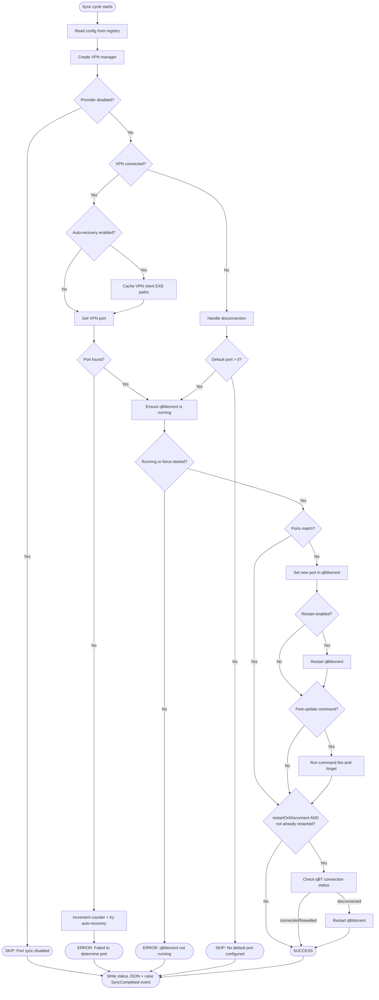
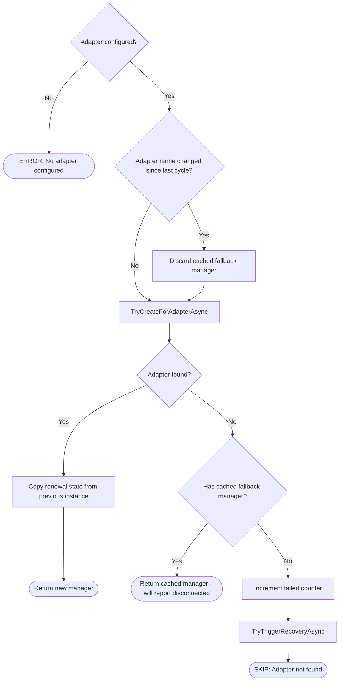

# qbPortWeaver - Sync Cycle Flow

This document describes the core port sync logic implemented in `PortSyncService.cs`. The sync cycle runs on a configurable interval (default 180s) and is serialized by a semaphore in `MainForm` - only one cycle runs at a time.

## High-Level Overview



## VPN Manager Creation

The sync cycle instantiates a provider-specific `IVpnManager` based on the configured VPN provider setting.

| Provider   | Manager class      | Port detection method                          |
|------------|--------------------|-------------------------------------------------|
| Disabled   | _(none)_           | Port sync is skipped entirely; cycle proceeds to Media Manager |
| ProtonVPN  | `ProtonVpnManager` | Parses the ProtonVPN log file for the last assigned port |
| PIA        | `PiaVpnManager`    | Runs `piactl get portforward` and parses stdout |
| NAT-PMP    | `NatPmpManager`    | Sends a UDP port mapping request (RFC 6886) to the gateway |

Unknown provider values fall back to ProtonVPN with a warning. `Disabled` is the default for new installations.

### NAT-PMP Manager Creation

NAT-PMP has additional complexity because the adapter must be discovered each cycle and the manager carries renewal state between cycles.



**Why the fallback?** When a VPN reconnects, the network adapter may briefly disappear. Returning the last known `NatPmpManager` lets `IsVpnConnected()` report `false`, so the main flow handles disconnection gracefully (applies the default port or skips) instead of erroring out.

## VPN Disconnection Handling

When the VPN is detected as disconnected - or port detection fails despite the VPN being connected - the cycle increments a consecutive-failure counter. This counter drives two behaviors:

1. **Default port fallback** - if `DefaultPort > 0`, the cycle applies it to qBittorrent so the client remains functional (typically on a non-VPN port). If `DefaultPort == 0`, the cycle is skipped entirely.

2. **Auto-recovery** - if enabled, once the counter reaches the configured threshold, the cycle:
   - Resets the counter (to prevent repeated triggers)
   - Determines the recovery action and target based on the provider type:
     - **ProtonVPN / PIA (direct or NAT-PMP mode):** action = `restart`, target = provider token (e.g. "ProtonVPN", "PIA") - the helper maps the token to the actual Windows service name and restarts it
     - **NAT-PMP with a generic gateway:** action = `cycle-adapter`, target = adapter name - the helper disables and re-enables the adapter via netsh
   - Sends the recovery request to the helper service (runs as SYSTEM) via named pipe
   - If the target matches a known provider's client process, restarts it in the user session

```
Cycle 1: VPN disconnected        → counter=1 (threshold=3, no action)
Cycle 2: VPN disconnected        → counter=2 (threshold=3, no action)
Cycle 3: VPN disconnected        → counter=3 → TRIGGER RECOVERY → counter=0
Cycle 4: VPN still down          → counter=1 (recovery in progress)
Cycle 5: VPN reconnects, port OK → counter=0
```

Port detection failures follow the same pattern:

```
Cycle 1: VPN connected, port OK      → counter=0
Cycle 2: VPN connected, port failed  → counter=1
Cycle 3: VPN connected, port failed  → counter=2
Cycle 4: VPN connected, port failed  → counter=3 → TRIGGER RECOVERY → counter=0
```

### Counter Reset Rules

The counter is reset to zero only after a successful port detection (`GetVpnPortAsync` returns a valid port). This applies uniformly to all providers - both VPN disconnection and port detection failure accumulate toward the auto-recovery threshold.

## qBittorrent Interaction

All qBittorrent communication goes through `QBittorrentManager`, which wraps the [qBittorrent Web API](https://github.com/qbittorrent/qBittorrent/wiki/WebUI-API-(qBittorrent-4.1)).

### Port Update Sequence

```
1. GET  /api/v2/app/preferences  → read listen_port + current_interface_name
2. POST /api/v2/app/setPreferences  → set listen_port (only if different)
3. (optional) Kill + relaunch qBittorrent process (if restart enabled)
4. (optional) Run post-update shell command
5. (optional) GET /api/v2/transfer/info → check connection_status
              If "disconnected" → kill + relaunch qBittorrent
              Skipped if step 3 already restarted (avoids redundant restart)
```

### Interface Mismatch Warning

When enabled, the cycle compares qBittorrent's bound network interface (`current_interface_name` from preferences) against the configured VPN provider name. A mismatch raises the `InterfaceMismatchDetected` event, which shows a balloon tip from the tray icon. This helps catch cases where qBittorrent is routing traffic outside the VPN tunnel.

## Status Output

Every cycle writes a JSON status file (`status.json` next to the log file) capturing the full cycle outcome. External tools can read this file to monitor sync health.

```json
{
  "appVersion": "2.x.y",
  "timestamp": "2026-01-01T12:00:00+00:00",
  "vpnProvider": "ProtonVPN",
  "vpnConnected": true,
  "vpnPort": 51234,
  "qBittorrentRunning": true,
  "qBittorrentPreviousPort": 44000,
  "qBittorrentPort": 51234,
  "portChanged": true,
  "updateIntervalSeconds": 180,
  "status": "success",
  "message": "Sync cycle completed"
}
```

The `status` field is one of:
- **`success`** - port synced (or already matched)
- **`error`** - something failed (VPN port unreadable, qBittorrent unreachable, etc.)
- **`skipped`** - VPN disconnected and no default port configured (no-op cycle)

## Method Call Map

```
RunAsync
 └─ RunCoreAsync
     ├─ ReadConfig
     ├─ CreateVpnManager
     │   └─ CreateNatPmpVpnManager (NAT-PMP only)
     │       ├─ BuildCycleCountMessage
     │       └─ TryTriggerRecoveryAsync
     ├─ IVpnManager.IsVpnConnected
     ├─ (if disconnected)
     │   ├─ BuildCycleCountMessage
     │   └─ TryTriggerRecoveryAsync
     ├─ (if connected)
     │   ├─ AutoRecoveryManager.CacheRunningClientExePaths
     │   ├─ IVpnManager.GetVpnPortAsync
     │   └─ HandlePortDetectionFailureAsync (if port null, all providers)
     │       ├─ BuildCycleCountMessage
     │       └─ TryTriggerRecoveryAsync
     └─ EnsureRunningAndUpdatePortAsync
         ├─ EnsureQBittorrentRunningAsync
         ├─ QBittorrentManager.GetPreferencesAsync
         ├─ CheckInterfaceMatch
         ├─ ApplyPortUpdateAsync
         │   ├─ QBittorrentManager.SetListeningPortAsync
         │   ├─ QBittorrentManager.RestartAsync
         │   └─ RunPostUpdateCommand
         ├─ CheckAndRestartIfDisconnectedAsync (skipped if already restarted)
         │   └─ QBittorrentManager.RestartAsync
         └─ SetCompleted
```

---

## Media Manager

The Media Manager runs on every sync cycle immediately after port sync completes. When VPN Provider is set to **Disabled**, port sync is skipped entirely and the Media Manager runs as the only step.

### Scan Phases

The Media Manager scan is split into two phases that partially overlap for performance.

```
                           ┌─ BuildLibraryIndex ──────────────────────────────┐
                           │  Walk library folders, fingerprint in parallel    │  Run
  Task.Run ───────────────►│  (degree 8), load/prune persisted cache.          │  concurrently
                           │  Semaphore prevents duplicate builds. Sync cycles │
                           │  reuse cached index; full rebuild every 10 cycles.│
                           └──────────────────────────────────────────────────►│
                                                                               │
  Phase 1: EnumerateSourceFoldersAsync ─────────────────────────────────────► │
    For each source folder (concurrent), call DirectoryInfo.EnumerateFiles.    │
    FileInfo metadata (size, last-write) comes from the directory listing -    │
    no extra stat per file. Filters to video files that are ready for import.  │
                                                                               │
                           Phase 2: FingerprintSourceFoldersAsync ─────────── ▼ (waits for both)
                             For each enumerated file, reads 128 KB (first +
                             last 64 KB) and computes a size:SHA-256 fingerprint.
                             Parallel.ForEach (degree 8) keeps storage throughput
                             high. Files whose fingerprint is in the library index
                             are skipped as already imported. The rest are split
                             into movie files and TV episode files.
```

### Lazy Fingerprint Deduplication

If `RunAsync` and `ScanAsync` overlap (e.g. a manual **Scan Now** triggered while a sync cycle is running), both call `FingerprintSourceFoldersAsync` concurrently. A `ConcurrentDictionary<string, Lazy<string>>` ensures that when two threads race on the same source file, only one issues the 128 KB read while the other waits on the same `Lazy<string>` and reuses the result.

### Cache Layers

| Cache | File | Key |
|---|---|---|
| Source scan | `qbPortWeaver.mediasource.json` | Source file path → size + last-write + fingerprint |
| Library | `qbPortWeaver.medialibrary.json` | Library file path → size + last-write + fingerprint |
| TMDB movies | `qbPortWeaver.tmdb.movies.json` | Title + year → TMDB movie result |
| TMDB TV shows | `qbPortWeaver.tmdb.tvshows.json` | Title + year → TMDB TV show result |

On a warm cache scan (no files changed since the last cycle), fingerprinting is skipped entirely for both source and library files; candidates are approved in microseconds from the in-memory cache.

### Method Call Map

```
MediaManagerService.RunAsync / ScanAsync
 ├─ MediaImporter.LoadSourceCache           (load source fingerprint cache from disk)
 ├─ TmdbCacheManager.Load / Evict         (load TMDB result cache from disk)
 │
 ├─ [concurrent] MediaImporter.BuildLibraryIndex
 │   ├─ LoadLibraryCache
 │   ├─ EnumerateLibraryFolder (per library folder)
 │   ├─ FingerprintLibraryFiles (per library folder, Parallel.ForEach degree 8)
 │   │   └─ GetOrComputeLibraryFingerprint (per file)
 │   └─ PruneLibraryCache
 │
 ├─ [concurrent] EnumerateSourceFoldersAsync  [Phase 1]
 │   └─ EnumerateSourceFolder (per folder, concurrent)
 │
 ├─ FingerprintSourceFoldersAsync  [Phase 2 - waits for Phase 1 + library index]
 │   └─ FingerprintCandidates (per folder, Parallel.ForEach degree 8)
 │       └─ MediaImporter.IsAlreadyInLibrary (per file)
 │           └─ GetOrComputeSourceFingerprint (with Lazy deduplication)
 │
 ├─ ProcessSourceFolderAsync / ScanSourceFolderAsync (per folder, concurrent)
 │   ├─ MovieProcessor.ProcessMoviesAsync / ScanMoviesAsync
 │   │   ├─ ClassifyVideoFiles (self-describing vs folder-dependent)
 │   │   ├─ GetOrLookupMovieAsync → LookupMovieAsync
 │   │   │   └─ TmdbClient.SearchWithConfidenceAsync → FileNameParser.TryFallbackLookupsAsync
 │   │   └─ MediaManagerService.ImportFileWithLog / MediaProposal
 │   └─ TvShowProcessor.ProcessTvShowsAsync / ScanTvShowsAsync
 │       ├─ FileNameParser.ParseTvShowEpisode (per file)
 │       ├─ GetOrLookupShowAsync → LookupTvShowAsync
 │       │   └─ TmdbClient.SearchWithConfidenceAsync → FileNameParser.TryFallbackLookupsAsync
 │       └─ MediaManagerService.ImportFileWithLog / MediaProposal
 │
 ├─ TmdbCacheManager.Save
 ├─ MediaImporter.SaveSourceCache
 └─ MediaImporter.SaveLibraryCache
```
