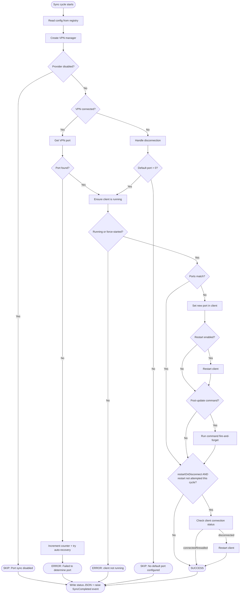

# qbPortWeaver - Sync Cycle Flow

This document describes the core port sync logic implemented in `PortSyncService.cs`. The sync cycle runs on a configurable interval (default 180s). Each port sync cycle is serialized by a semaphore in `MainForm` so port sync cycles never overlap. The Media Manager runs as a fire-and-forget task after each port sync, in parallel with the next cycle's wait; subsequent imports are skipped if a previous one is still running, so a slow library scan cannot delay port sync or pile up imports on slow storage.

## High-Level Overview



## VPN Manager Creation

The sync cycle instantiates a provider-specific `IVpnManager` based on the configured VPN provider setting.

| Provider   | Manager class      | Port detection method                          |
|------------|--------------------|-------------------------------------------------|
| Disabled   | _(none)_           | Port sync is skipped entirely; cycle proceeds to Media Manager |
| ProtonVPN  | `ProtonVpnManager` | Parses the ProtonVPN log file for the last assigned port |
| PIA        | `PiaVpnManager`    | Runs `piactl get portforward` and parses stdout |
| NAT-PMP    | `NatPmpManager`    | Sends a UDP port mapping request (RFC 6886) to the gateway |

`Disabled` is the default for new installations.

### NAT-PMP Manager Creation

NAT-PMP has additional complexity because the adapter must be discovered each cycle and the manager carries renewal state between cycles.


**Why the fallback?** When a VPN reconnects, the network adapter may briefly disappear. Returning the last known `NatPmpManager` lets `IsVpnConnected()` report `false`, so the main flow handles disconnection gracefully (applies the default port or skips) instead of erroring out.

## VPN Disconnection Handling

When the VPN is detected as disconnected - or port detection fails despite the VPN being connected - the cycle increments a consecutive-failure counter. This counter drives two behaviors:

1. **Default port fallback** - if `DefaultPort > 0`, the cycle applies it to the BitTorrent client so it remains functional (typically on a non-VPN port). If `DefaultPort == 0`, the cycle is skipped entirely.

2. **Auto-recovery** - if enabled, once the counter reaches the configured threshold, the cycle:
   - Resets the counter (to prevent repeated triggers)
   - Determines the recovery action and target based on the provider type:
     - **ProtonVPN / PIA (direct or NAT-PMP mode):** action = `restart`, target = the resolved Windows service name - the main app auto-discovers the service name and sends it to the helper, which restarts it directly
     - **NAT-PMP with a generic gateway:** action = `cycle-adapter`, target = adapter name - the helper disables and re-enables the adapter via netsh
   - Sends the recovery request to the helper service (runs as SYSTEM) via named pipe
   - If the target matches a known provider's client process, restarts it in the user session

```
Cycle 1: VPN disconnected        → counter=1 (threshold=3, no action)
Cycle 2: VPN disconnected        → counter=2 (threshold=3, no action)
Cycle 3: VPN disconnected        → counter=3 → TRIGGER RECOVERY → counter=0
Cycle 4: VPN still down          → counter=1 (recovery in progress)
Cycle 5: VPN reconnects, port OK → counter=0
```

Port detection failures follow the same pattern:

```
Cycle 1: VPN connected, port OK      → counter=0
Cycle 2: VPN connected, port failed  → counter=1
Cycle 3: VPN connected, port failed  → counter=2
Cycle 4: VPN connected, port failed  → counter=3 → TRIGGER RECOVERY → counter=0
```

### Counter Reset Rules

The counter resets in two cases:
- **Successful port detection**: `GetVpnPortAsync` returns a valid port. Applies uniformly to all providers; both VPN disconnection and port detection failure accumulate toward the threshold.
- **Auto-recovery disabled**: if the feature is turned off, the counter resets each cycle so it does not carry over stale state when the feature is re-enabled.

## BitTorrent Client Interaction

All client communication goes through the `IBitTorrentClient` interface, with implementations for qBittorrent (`QBittorrentClient`), Transmission (`TransmissionClient`), and Deluge (`DelugeClient`). The active implementation is selected each cycle based on the configured client setting.

### Port Update Sequence

```
1. Read current port:
   GET /api/v2/app/preferences   → listen_port + current_interface_name  [qBittorrent]
   session-get                   → peer-port + bind-address-ipv4          [Transmission]
   core.get_config_values        → listen_ports / listen_random_port      [Deluge]

2. Set new port (only if different):
   POST /api/v2/app/setPreferences                                        [qBittorrent]
   session-set                                                            [Transmission]
   core.set_config                                                        [Deluge]

3. (optional) Show tray balloon tip if NotifyOnPortUpdate is enabled (raises PortUpdated event)
4. (optional) Restart client process or service (if restart enabled)
5. (optional) Run post-update shell command
6. (optional, qBittorrent only) GET /api/v2/transfer/info → check connection_status
              If "disconnected" → restart qBittorrent
              Skipped if step 4 already restarted (avoids redundant restart)
```

### Interface Mismatch Warning *(qBittorrent only)*

When enabled, the cycle compares qBittorrent's bound network interface (`current_interface_name` from preferences) against the configured VPN provider name. A mismatch raises the `InterfaceMismatchDetected` event, which shows a warning balloon tip from the tray icon. This helps catch cases where qBittorrent is routing traffic outside the VPN tunnel. Transmission and Deluge do not expose a named adapter via their APIs, so this check is skipped for those clients.

### Port Update Notification

When `NotifyOnPortUpdate` is enabled (General settings, default on), a successful port change raises the `PortUpdated` event immediately after `ApplyPortUpdateAsync` returns. `MainForm` handles this with a tray balloon tip (`ToolTipIcon.Info`). The notification fires for all three clients.

### Log Alert Notifications

`LogManager` raises a `WarnOrErrorLogged` event (outside the write lock) whenever a `Warn` or `Error` entry is written. `MainForm` subscribes and marshals to the UI thread to:

- Show a `ToolTipIcon.Warning` balloon tip once per unseen session. Clicking the balloon opens the log viewer scrolled to the most recent warning or error.
- Update the **Show Logs** context menu item text with a running count (e.g. "Show Logs (2 warnings, 1 error)").
- Append a human-readable count to the tray tooltip (e.g. "2 Warnings, 1 Error").

All three indicators reset when the user opens the log viewer or clears the logs. `MainForm` unsubscribes in `OnFormClosing` before teardown to prevent background threads from marshalling onto a disposed form handle.

## Status Output

Every cycle writes a JSON status file (`qbPortWeaver.status.json` in `%LocalAppData%\qbPortWeaver\`) capturing the full cycle outcome. External tools can read this file to monitor sync health.

```json
{
  "appVersion": "2.x.y",
  "timestamp": "2026-01-01T12:00:00+00:00",
  "vpnProvider": "ProtonVPN",
  "vpnConnected": true,
  "vpnPort": 51234,
  "clientRunning": true,
  "clientPreviousPort": 44000,
  "clientPort": 51234,
  "portChanged": true,
  "updateIntervalSeconds": 180,
  "status": "success",
  "message": "Sync cycle completed"
}
```

The `status` field is one of:
- **`success`** - port synced (or already matched)
- **`error`** - something failed (VPN port unreadable, client unreachable, etc.)
- **`skipped`** - VPN disconnected and no default port configured (no-op cycle)

## Method Call Map

```
RunAsync
 └─ RunCoreAsync
     ├─ ReadConfig
     ├─ CreateVpnManager
     │   └─ CreateNatPmpVpnManager (NAT-PMP only)
     │       └─ RegisterFailureAndTryRecoveryAsync
     │           ├─ BuildCycleCountMessage
     │           └─ TryTriggerRecoveryAsync
     ├─ IVpnManager.IsVpnConnected
     ├─ (if disconnected)
     │   └─ RegisterFailureAndTryRecoveryAsync
     │       ├─ BuildCycleCountMessage
     │       └─ TryTriggerRecoveryAsync
     ├─ (if connected)
     │   ├─ IVpnManager.GetVpnPortAsync
     │   └─ HandlePortDetectionFailureAsync (if port null, all providers)
     │       └─ RegisterFailureAndTryRecoveryAsync
     │           ├─ BuildCycleCountMessage
     │           └─ TryTriggerRecoveryAsync
     └─ EnsureRunningAndUpdatePortAsync
         ├─ EnsureClientRunningAsync
         ├─ IBitTorrentClient.GetPreferencesAsync
         ├─ CheckInterfaceMatch (qBittorrent only)
         ├─ ApplyPortUpdateAsync
         │   ├─ IBitTorrentClient.SetListeningPortAsync
         │   ├─ IBitTorrentClient.RestartAsync
         │   └─ RunPostUpdateCommand
         ├─ PortUpdated?.Invoke (if NotifyOnPortUpdate and port changed)
         ├─ CheckAndRestartIfDisconnectedAsync (qBittorrent only; skipped if already restarted)
         │   └─ IBitTorrentClient.RestartAsync
         └─ SetSyncResult
```

---

## Media Manager

The Media Manager runs after every sync cycle as a fire-and-forget task, in parallel with the wait until the next port sync cycle. If a previous import is still running when the next cycle ends, the new import is skipped to avoid pile-up on slow storage. When VPN Provider is set to **Disabled**, port sync is skipped entirely but the Media Manager still runs (kicked off after the no-op cycle).

### Scan Phases

The Media Manager scan is split into two phases that partially overlap for performance.

```
                           ┌─ BuildLibraryIndex ──────────────────────────────┐
                           │  Walk library folders, fingerprint in parallel    │  Run
  Task.Run ───────────────►│  (degree 8), load/prune persisted cache.          │  concurrently
                           │  Semaphore prevents duplicate builds. Sync cycles │
                           │  reuse cached index; full rebuild every 10 cycles.│
                           │  Returns false if a folder enumeration fails -    │
                           │  prior index is preserved and import cycle skips, │
                           │  so a partial index can't false-classify files.   │
                           └──────────────────────────────────────────────────►│
                                                                               │
  Phase 1: EnumerateSourceFoldersAsync ─────────────────────────────────────► │
    For each source folder (concurrent), call DirectoryInfo.EnumerateFiles.    │
    FileInfo metadata (size, last-write) comes from the directory listing -    │
    no extra stat per file. Filters to video files that are ready for import.  │
                                                                               │
                           Phase 2: ClassifySourceFoldersAsync ─────────── ▼ (waits for both)
                             For each enumerated file, reads 128 KB (first +
                             last 64 KB) and computes a size:SHA-256 fingerprint.
                             Parallel.ForEach (degree 8) keeps storage throughput
                             high. Files whose fingerprint is in the library index
                             are skipped as already imported. The rest are split
                             into movie files and TV episode files.
```

### Lazy Fingerprint Deduplication

If `ImportAsync` and `ScanAsync` overlap (e.g. a manual **Scan Now** triggered while a sync cycle is running), both call `ClassifySourceFoldersAsync` concurrently. A `ConcurrentDictionary<string, Lazy<string>>` ensures that when two threads race on the same source file, only one issues the 128 KB read while the other waits on the same `Lazy<string>` and reuses the result.

### Cache Layers

| Cache | File | Key |
|---|---|---|
| Source scan | `qbPortWeaver.mediasource.json` | Source file path → size + last-write + fingerprint |
| Library | `qbPortWeaver.medialibrary.json` | Library file path → size + last-write + fingerprint |
| TMDB movies | `qbPortWeaver.tmdb.movies.json` | Title + year → TMDB movie result |
| TMDB TV shows | `qbPortWeaver.tmdb.tvshows.json` | Title + year → TMDB TV show result |

On a warm cache scan (no files changed since the last cycle), fingerprinting is skipped entirely for both source and library files; candidates are approved in microseconds from the in-memory cache.

### Method Call Map

```
MediaManagerService.ImportAsync / ScanAsync
 ├─ MediaImporter.LoadSourceCache           (load source fingerprint cache from disk)
 ├─ TmdbCacheManager.Load / Evict         (load TMDB result cache from disk)
 │
 ├─ [concurrent] MediaImporter.BuildLibraryIndex
 │   ├─ LoadLibraryCache
 │   ├─ EnumerateLibraryFolder (per library folder)
 │   ├─ FingerprintLibraryFiles (per library folder, Parallel.ForEach degree 8)
 │   │   └─ GetOrComputeLibraryFingerprint (per file)
 │   └─ PruneLibraryCache
 │
 ├─ [concurrent] EnumerateSourceFoldersAsync  [Phase 1]
 │   └─ EnumerateSourceFolder (per folder, concurrent)
 │
 ├─ ClassifySourceFoldersAsync  [Phase 2 - waits for Phase 1 + library index]
 │   └─ ClassifyCandidates (per folder, Parallel.ForEach degree 8)
 │       └─ MediaImporter.IsAlreadyInLibrary (per file)
 │           └─ GetOrComputeSourceFingerprint (with Lazy deduplication)
 │
 ├─ ProcessSourceFolderAsync / ScanSourceFolderAsync (per folder, concurrent)
 │   ├─ MovieProcessor.ProcessMoviesAsync / ScanMoviesAsync
 │   │   ├─ ClassifyVideoFiles (self-describing vs folder-dependent)
 │   │   ├─ GetOrLookupMovieAsync
 │   │   │   └─ TmdbClient.LookupAsync → SearchWithConfidenceAsync (confidence tracking + fallback strategies)
 │   │   └─ MediaManagerService.ImportFile / MediaProposal
 │   └─ TvShowProcessor.ProcessTvShowsAsync / ScanTvShowsAsync
 │       ├─ FileNameParser.ParseTvShowEpisode (per file)
 │       ├─ GetOrLookupTvShowAsync
 │       │   └─ TmdbClient.LookupAsync → SearchWithConfidenceAsync (confidence tracking + fallback strategies)
 │       └─ MediaManagerService.ImportFile / MediaProposal
 │
 ├─ TmdbCacheManager.Save
 ├─ MediaImporter.SaveSourceCache
 └─ MediaImporter.SaveLibraryCache
```
