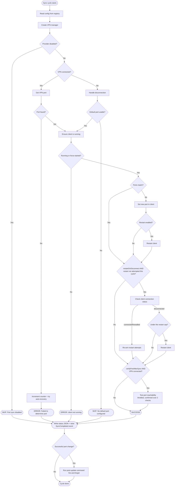
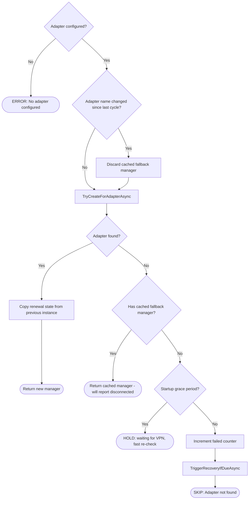

# qbPortWeaver - Sync Cycle Flow

This document describes the core port sync logic implemented in `PortSyncService.cs`. The sync cycle runs on a configurable interval (default 180s). Each port sync cycle is serialized by a semaphore in `MainForm` so port sync cycles never overlap. The Media Manager runs as a fire-and-forget task after each port sync, in parallel with the next cycle's wait; subsequent imports are skipped if a previous one is still running, so a slow library scan cannot delay port sync or pile up imports on slow storage.

The tray menu's **Pause Syncing** item skips entire cycles (port sync and the Media Manager kick-off) until resumed; the tray icon shows the paused state and **Sync Port Now** still runs a single cycle on demand. The paused state is in-memory only - a restart always resumes syncing.

Beyond the fixed interval, a cycle can start early when the user clicks **Sync Port Now**, after a settings change, or - when **Sync on network change** is enabled (General settings, default on) - when a network or VPN connection change is detected. Network-change triggers are debounced in `MainForm`, so a reconnect's burst of events collapses into a single wake, and they give that cycle one short follow-up wait so a cycle that ran before the VPN finished settling retries promptly instead of resetting to a full interval. Network-change triggers respect pause (no cycle runs while paused).

## High-Level Overview



> During the startup grace period (see Startup Grace Period), the *Handle disconnection* and *port not found* paths - and the NAT-PMP "adapter not found" path - instead hold quietly and re-check on a fast poll, without incrementing the failure counter or applying the default port.

## VPN Manager Creation

The sync cycle instantiates a provider-specific `IVpnManager` based on the configured VPN provider setting.

| Provider   | Manager class      | Port detection method                          |
|------------|--------------------|-------------------------------------------------|
| Disabled   | _(none)_           | Port sync is skipped entirely; cycle proceeds to Media Manager |
| ProtonVPN  | `ProtonVpnManager` | Parses the ProtonVPN log file for the last assigned port |
| PIA        | `PiaVpnManager`    | Runs `piactl get portforward` and parses stdout |
| NAT-PMP    | `NatPmpManager`    | Sends a port mapping request (RFC 6886) to the gateway, for UDP then TCP |

`Disabled` is the default for new installations.

> **ProtonVPN adapter names:** ProtonVPN's tunnel adapter is named `ProtonVPN` (standard WireGuard) or `ProtonVPN TUN` (OpenVPN) on the earlier protocols, and `ProTUN` on the newer Proton Protocols (Proton WireGuard, Proton Stealth). The earlier names are matched via the registry-driven `protonVpnAdapterName` value (bidirectional substring) and `ProTUN` via `protonVpnNativeAdapterName`, so detection and interface matching work across protocols without reconfiguration.

### NAT-PMP Manager Creation

NAT-PMP has additional complexity because the adapter must be discovered each cycle and the manager carries renewal state between cycles.



**Why the fallback?** When a VPN reconnects, the network adapter may briefly disappear. Returning the last known `NatPmpManager` lets `IsVpnConnected()` report `false`, so the main flow handles disconnection gracefully (applies the default port or skips) instead of erroring out.

## Startup Grace Period

Right after the app starts, the VPN is often still connecting (VPN clients launch at login and take a few seconds to a minute to establish). When **Wait for VPN on startup** is enabled (General settings, default on), for the first `StartupGracePeriodSeconds` (90s, measured from `PortSyncService` construction) a not-yet-usable VPN is treated as expected rather than a failure. During this window, if the VPN is disconnected, is connected but has not assigned a port yet, or (NAT-PMP) its adapter is not yet discoverable, the cycle holds quietly instead of taking the normal disconnection path:

- The tray shows a dedicated neutral `WaitingForVpn` state (not the orange disconnected state), the outcome is logged at `Info` (not `Warn`), and the status is written as `skipped` with `waitingForVpn: true`.
- No failure is registered, so the auto-recovery counter does not advance and no recovery runs.
- No default-port fallback is applied.
- The cycle re-checks quickly - it returns `min(StartupGracePollSeconds (15s), update interval)` as the next wait instead of the full interval - so the port syncs within seconds of the VPN coming up.

`ShouldWaitForVpnStartup` gates all three hold points; `MarkWaitingForVpn` records the quiet outcome. The per-check log line carries a countdown (`... (startup grace period, ~45s left)`), and the same "startup grace period" wording appears in the tray tooltip and the Status panel. A successful connection within the window clears the hold silently; if the window elapses with the VPN still down (or the setting is turned off), a one-time `Startup grace period ended - resuming normal handling` line is logged and the cycle falls through to the normal disconnection handling below.

## VPN Disconnection Handling

When the VPN is detected as disconnected - or port detection fails despite the VPN being connected - the cycle increments a consecutive-failure counter. This counter drives two behaviors:

1. **Default port fallback** - if `DefaultPort` is a usable port, the cycle applies it to the client so it remains functional (typically on a non-VPN port). If it is `0`, or outside the usable range, the cycle is skipped entirely.

2. **Auto-recovery** - if enabled, once the counter reaches the configured threshold *and* the failure streak has lasted at least `(threshold - 1) x interval` seconds, the cycle:
   - Resets the counter (to prevent repeated triggers)
   - Determines the recovery action and target based on the provider type:
     - **ProtonVPN / PIA (direct or NAT-PMP mode):** action = `restart`, target = the resolved Windows service name - the main app auto-discovers the service name and sends it to the helper, which restarts it directly
     - **NAT-PMP with a generic gateway:** action = `cycle-adapter`, target = adapter name - the helper disables and re-enables the adapter via netsh
   - Passes through the connectivity rate limiter (below)
   - Sends the recovery request to the helper service (runs as SYSTEM) via named pipe. After a service restart the helper **verifies** the service actually reached Running (`AutoRecovery.VerifyServiceRunningAsync`) rather than reporting success on the strength of having issued the start: `StartServiceAsync` deliberately swallows a start timeout, so without the check a service that never came back would still be logged as "Restarted". A service left not-Running is logged at **Error**, which travels back over the pipe in the helper's ERROR count and raises the tray alert. That matters most with a VPN killswitch enabled, where a service that fails to restart leaves the machine with no network at all.

     **Log levels around the force-kill escalation.** The helper's WARN count travels back over the same pipe as the ERROR count and also raises the tray warning badge, so what the helper logs at Warn is a user-visible signal, not just text in a file. Levels are therefore assigned by outcome, not by drama: *announcing* an escalation to a force-kill is **Info** (it is the designed fallback), a stage that *succeeds* is **Info** ("force-killed via ..."), and only a stage that *fails* is **Warn** ("Failed to ...", "could not be killed", "still running"). This is not a rare path - ProtonVPN's service does not accept an SCM stop while its tunnel is up, so a normal recovery times out after `ServiceOperationTimeoutMs` and force-kills **every time**; its own restart-on-failure policy then usually brings it back before the helper issues the start, which is why the log often reads "is already running". Logging that sequence at Warn made every successful recovery badge the tray as though something had gone wrong. The main app follows the same rule: `ProcessControl` logs only kill outcomes, and `AutoRecoveryManager` logs a successful kill at Info.
     **Protocol version.** The helper reports which protocol version it speaks on every response (`v=1`), and a response without that key came from a helper built before versioning existed. That is what lets the app tell an *out-of-date* helper from an *unreachable* one and say "reinstall qbPortWeaver to update it" rather than leaving both looking like a generic failure. The version travels on the response rather than the request because the two halves upgrade independently and the request format is frozen at three fields: an already-installed helper parses requests with `Split('|', 3)`, so a fourth field either shifts the action out of position (the old helper then falls through to its unknown-action branch but **still writes a normal success response**, reporting a recovery that never ran) or lands inside the session token (rejected as a token mismatch). Responses are `key=value` pairs and the client skips keys it does not recognise, so response fields are append-only and safe to extend; anything the helper must be *told* needs a new action name instead, which an old helper rejects loudly rather than silently.
   - If the target matches a known provider's client process, restarts it in the user session

### Connectivity Rate Limiter

The **failed-cycle trigger only** passes through `TryTakeRecoverySlotAsync`, which asks `InternetConnectivityProbe` whether the machine can reach the internet at all. The port-closed trigger is deliberately exempt: it only runs after a successful VPN port fetch, so that path has already proven it has connectivity, and a machine that filters ICMP would otherwise be warned its internet is down moments after a clean sync. It is also one-shot, so it cannot loop the way the failed-cycle trigger could. The probe pings `1.1.1.1` and `8.8.8.8` concurrently with a 2s timeout and reports reachable if either replies. Public resolvers are addressed by IP on purpose: name resolution is one of the things an outage breaks, so a DNS-dependent probe would report "no internet" for a DNS fault that recovery might legitimately fix.

- **Reachable:** recovery runs immediately and the backoff resets.
- **Not reachable:** the first recovery of a streak still runs; later attempts wait 5, then 10, then 15 minutes, holding at 15 for as long as the condition lasts.

The distinction between rate-limiting and blocking is load-bearing, not a nicety. A VPN killswitch blocks the probe itself while the tunnel is down, so a machine whose VPN is genuinely stuck looks identical to one whose upstream is down. Refusing to recover outright would leave the killswitch up, the probe failing, and the machine deadlocked with no way out - so recovery is slowed but never stopped. The elapsed-time comparison uses `Environment.TickCount64`, which is monotonic: a machine returning from an outage often corrects its clock by NTP, and a backward jump must not release every held attempt at once.

The attempt counter is cleared from two places, and both are needed: the probe succeeding, and a successful port fetch in the sync cycle. Once the VPN is healthy recovery is never dispatched, so the probe branch alone would leave a stale count behind and delay the first attempt of a later, unrelated outage.

The gate sits **above** `ResetFailureStreak()`, so a held attempt leaves the failure streak intact. This matters for the cadence: were the streak reset on a hold, the next attempt would have to rebuild it and clear the sustained-failure floor again before the backoff even applied, making the real spacing longer than 5/10/15 by an amount depending on the configured interval. Leaving it hot means the streak stays above the trigger threshold, the probe runs once per cycle while offline (one ping, negligible), and the timing is governed by the backoff alone.

### Usable Port Rule

Both ports that can reach the client go through the same check (`AppConstants.IsUsablePort`, 1-65535).

- A **provider-reported** port outside the range is logged at Warn and discarded, and the cycle falls through to its no-port branch, so the grace window, the failure streak and auto-recovery behave exactly as they do when no port was reported at all. ProtonVPN's log carries a port pair while a mapping is being torn down, which is the case this was added for.
- A **default port** outside the range is logged at Warn and treated as `0`, so the cycle is skipped rather than applying it. Only a hand-edited registry value can get there (the Settings spinner caps it, and re-saving clamps it back), so this is a floor under that rather than the primary validation.

The rule exists because most clients treat `0` as "pick a random port", which would quietly undo the forwarding the app maintains while the cycle still reported success.

The time floor exists because a cycle can start early - a manual sync, a settings change, or (most commonly) a burst of network-change re-syncs while connectivity flaps during a router reboot. Without it, several early cycles can drive the counter to the threshold within seconds and force-restart the VPN service during a transient blip that would have cleared on its own. `(threshold - 1) x interval` is exactly the elapsed time the streak would take under normal scheduled cycling (failure 1 at t=0, failure N at t=`(N-1) x interval`), so a genuine sustained outage still triggers at the same moment it always did - the floor only defers recovery when failures arrive faster than the schedule. The streak's start time is re-stamped on each streak's first failure, so it always describes the streak in progress.

```
interval=45s, threshold=3 → time floor = (3-1) x 45 = 90s

Sustained outage (normal cadence):
Cycle 1 (t=0s):   VPN disconnected   → counter=1 (no action)
Cycle 2 (t=45s):  VPN disconnected   → counter=2 (no action)
Cycle 3 (t=90s):  VPN disconnected   → counter=3, 90s elapsed ≥ 90s → TRIGGER RECOVERY → counter=0

Brief blip raced by network-change re-syncs:
Cycle 1 (t=0s):   VPN disconnected   → counter=1 (no action)
Cycle 2 (t=26s):  VPN disconnected   → counter=2 (no action)
Cycle 3 (t=31s):  VPN disconnected   → counter=3, only 31s elapsed < 90s → HOLD
Cycle 4 (t=44s):  VPN reconnects, port OK → counter=0 (recovery never fired)
```

Port detection failures follow the same pattern:

```
Cycle 1: VPN connected, port OK      → counter=0
Cycle 2: VPN connected, port failed  → counter=1
Cycle 3: VPN connected, port failed  → counter=2
Cycle 4: VPN connected, port failed  → counter=3 → TRIGGER RECOVERY → counter=0
```

### Counter Reset Rules

The counter resets in two cases (the streak start time is simply re-stamped when the next streak begins):
- **Successful port detection**: `GetVpnPortAsync` returns a valid port. Applies uniformly to all providers; both VPN disconnection and port detection failure accumulate toward the threshold.
- **Auto-recovery disabled**: if the feature is turned off, the counter resets each cycle so it does not carry over stale state when the feature is re-enabled.

All resets flow through a single `ResetFailureStreak` helper. It only zeroes the counter; the time floor never reads a stale start time because the timestamp is re-stamped on the next streak's first failure and is only consulted while the counter is non-zero.

### Manual Recovery Test

The Settings form's **Test** button (Auto-recovery header row) dispatches the same recovery action on demand via `PortSyncService.TestRecoveryAsync`, after a confirmation dialog. It uses the in-form provider selection (like the client Test buttons), bypasses every gate - counters, time floor, arming, and the connectivity rate limiter - and goes straight to `DispatchRecoveryAsync` with `manualTest = true`. The rate limiter is skipped deliberately: the user asked for the action explicitly, and a test that silently declined to run would be worse than useless for verifying the chain. A test is recorded in the port history as "Recovery test triggered" but is not counted in the session's Recoveries statistic; it arms the "after recovery" history annotation like an automatic dispatch, since its effect on the port is the same.

## Client Interaction

All client communication goes through the `IManagedClient` interface, with implementations for qBittorrent (`QBittorrentClient`), Transmission (`TransmissionClient`), Deluge (`DelugeClient`), and Nicotine+ (`NicotineClient`). The active implementation is selected each cycle based on the configured client setting.

> **Nicotine+** is a Soulseek client with no remote-control interface of its own. `NicotineClient` talks to the qbPortWeaver bridge plugin (`plugins/qbpw_nicotine_bridge/`), a GPL-3.0 Nicotine+ plugin that serves a token-authenticated JSON API on `127.0.0.1`. The plugin discovers itself to qbPortWeaver by writing its address and token to `%LocalAppData%\qbPortWeaver\nicotine-bridge.json`, which `NicotinePluginDiscovery` reads. It applies a port change by rewriting the setting and forcing a reconnect - the same thing the Preferences dialog does - so the port is live in roughly five seconds with no restart. Accordingly `NicotineClient.RestartAsync` is a deliberate no-op: killing Nicotine+ would discard its configuration, since it only writes it on a graceful shutdown.

### Port Update Sequence

```
1. Read current port:
   GET /api/v2/app/preferences   → listen_port + current_interface_name  [qBittorrent]
   session-get                   → peer-port + bind-address-ipv4          [Transmission]
   core.get_config_values        → listen_ports / listen_random_port      [Deluge]
   GET /v1/preferences           → listen_port + interface                [Nicotine+]

2. Set new port (only if different):
   POST /api/v2/app/setPreferences                                        [qBittorrent]
   session-set                                                            [Transmission]
   core.set_config                                                        [Deluge]
   POST /v1/port                                                          [Nicotine+]

3. Record the change in the port history file (always on success - see Port History under
   Status Output), and (optional) show a tray balloon tip if NotifyOnPortUpdate is enabled
   (raises PortUpdated event)
4. (optional) Restart client process or service (if restart enabled)
5. (optional, qBittorrent only) GET /api/v2/transfer/info → check connection_status
              If "disconnected" → restart qBittorrent
              Skipped if step 4 already restarted (avoids redundant restart)
6. (optional) Verify outside reachability of the port (see Port Verification below):
   GET /api/v2/transfer/info     → connection_status connected/firewalled    [qBittorrent]
   port_test (ip_protocol=ipv4)  → port-is-open                              [Transmission]
   core.test_listen_port         → true/false                                [Deluge]
   POST /v1/porttest             → open/closed/pending                       [Nicotine+]
```

> The **post-update command** (if configured) is not part of this sequence: it is launched at the very end of the cycle, *after* the status JSON file is written (see Status Output) and only on a successful port change - so a script that reads the status file sees this cycle's result rather than the previous one.

### Interface Mismatch Warning *(qBittorrent and Nicotine+)*

When enabled, the cycle compares the client's bound network interface (`current_interface_name` from qBittorrent's preferences, `interface` from the Nicotine+ bridge - both Windows adapter friendly names) against the configured VPN provider name. A mismatch raises the `InterfaceMismatchDetected` event, which shows a warning balloon tip from the tray icon. This helps catch cases where qBittorrent is routing traffic outside the VPN tunnel. Transmission and Deluge do not expose a named adapter via their APIs, so this check is skipped for those clients.

> If qBittorrent stays bound to an old adapter name after a ProtonVPN protocol change (e.g. `ProtonVPN` while the active tunnel is now `ProTUN`), this warning fires correctly - rebind qBittorrent's network interface to the active adapter to clear it.

### Stale Interface Binding *(qBittorrent only)*

The check above compares the adapter *name*, but qBittorrent binds by a separate value.
`current_network_interface` holds an opaque token of the form `<type>_<index>` - `iftype53_32768`,
`ethernet_32768`, `loopback_0` - and that is what libtorrent resolves. `current_interface_name` is
the display name only.

When a VPN destroys and recreates its adapter, Windows issues a new index while the name is reused.
The stored token then resolves to nothing, so qBittorrent logs `The configured network interface is
invalid` and listens on no port - while the name check above still passes, because the name is
genuinely correct. Restarting cannot help: the token is persisted configuration and is re-read
unchanged. If the token instead resolves to a *different* live adapter of the same type, the client
reports itself connected while its traffic leaves outside the tunnel.

Each cycle, `QBittorrentClient.CheckInterfaceBindingAsync` reads the live pairs from
`GET /api/v2/app/networkInterfaceList` and looks up the entry whose `name` equals
`current_interface_name`. Resolution is by name, so the differing token formats never need parsing.
The binding is reported stale only when that entry exists and its token differs from the stored one;
every ambiguous case - no name, bound to all interfaces, adapter absent (the VPN is simply down), or
the endpoint missing on an older qBittorrent - is treated as "nothing to say".

Detection always runs, whatever the VPN provider is, because the binding can go stale without the
VPN being involved. What happens next depends on `fixInterfaceBinding` (qBittorrent section,
default on):

| setting | behaviour |
|---------|-----------|
| off | Warn plus a one-shot balloon, naming the stale binding and how to clear it |
| on  | `POST /api/v2/app/setPreferences` re-applies the resolved token **and** the name together, as the Web UI does when an adapter is picked |

The repair never writes an empty token: empty means *bind to every interface*, which would replace a
client that cannot connect with one reachable outside the tunnel. It is also attempted once per stale
streak - if the binding is still wrong on the next cycle something else is overwriting it, and
repeating the write every cycle would be its own loop. The attempt re-arms as soon as the binding
reads healthy.

### Restart-on-Disconnect Cap *(qBittorrent only)*

`restartOnDisconnect` restarts the client when it reports `disconnected`. That helps only when the
cause is the client's own state; when the cause is persisted configuration - a stale interface
binding being the known example - every restart re-reads the same value and reports disconnected
again. Restarts are therefore capped at three consecutive attempts, after which a single Warn names
the likely cause and further restarts are suspended. Any non-disconnected status re-arms the
allowance, so a later unrelated disconnect gets the full three attempts.

### Port Verification

When `verifyPortAfterSync` is enabled (General settings, default on) and the VPN is connected, the cycle ends by testing whether the synced port is actually reachable from the outside - not just configured.

| Client | Mechanism | Notes |
|---|---|---|
| qBittorrent | `connection_status` from `transfer/info`: connected = open, firewalled = closed | Inferred from incoming peer activity; an idle client may report closed indefinitely |
| Transmission | `port_test` RPC (`ip_protocol=ipv4`) | Active probe via Transmission's online port-check service. Uses the Transmission 4.1 method name, pinned to IPv4; falls back to the legacy `port-test` method on pre-4.1 daemons |
| Deluge | `core.test_listen_port` | Active probe via Deluge's online port-check service |
| Nicotine+ | `POST /v1/porttest` via the bridge plugin | The plugin uses Nicotine+'s native checker when the version exposes it (the `check-port-status` API, upstream #3373, not yet in a stable release); otherwise it falls back to querying the Soulseek port-test service (`slsknet.org/porttest.php`) over HTTP and parsing the `<port>/tcp open\|closed` verdict. Either way the plugin caps the wait below qbPortWeaver's HTTP timeout, so a slow or offline check returns `pending` and is treated as undetermined rather than closed |

**Throttle** - because three of the four mechanisms contact external check services, the test runs when the port changed this cycle, every cycle while a result awaits confirmation, and every cycle while confirmed-closed *and* port-closed recovery is still armed (so the recovery counter advances toward its trigger). Otherwise - and once recovery has fired (disarmed) or is off - it runs every 5th cycle, which still detects a reopen without hammering the external check services. The counter is initialised above the threshold so the first increment triggers immediately on the first eligible cycle after startup.

**Confirmation rule** - a single closed result logs at Info and forces a re-test on the next cycle; only the second consecutive closed result is treated as confirmed. This absorbs qBittorrent's idle-firewalled false positive and transient check-service glitches. A confirmed-closed port logs at Warn every cycle (so the log alert badge tracks the persistent condition, like the interface mismatch check) and raises the `PortVerificationFailed` event once, on the transition, for a tray warning balloon. Results that cannot be determined (client unreachable, check service down) leave the verification state unchanged - except while a closed result is awaiting confirmation, where three consecutive undetermined checks drop the pending state, log an Info line, and resume the normal throttle. Only the pending state forces a check every cycle, so only it needs bounding: without that cap an outage of the check service would be polled at full rate, by every install at once, for as long as it lasted. A later definite closed result simply starts the confirmation sequence again.

**Port-closed recovery** - when `portClosedRecoveryEnabled` is on (default on; requires port verification, but is independent of the failed-sync recovery trigger), a configurable number of confirmed closed checks (`portClosedRecoveryTriggerChecks`, default 3) dispatches the provider's normal recovery action (service restart, or adapter cycle for generic NAT-PMP gateways). The trigger is one-shot: after firing it stays disarmed until a verification reports the port open again, so a persistently false closed reading causes at most one recovery action and never a recovery loop.

**On-demand test** - the Status panel's **Test Port** button runs this same reachability check immediately via `PortSyncService.TestActivePortAsync`, against a fresh client outside the cycle. It bypasses the throttle and the confirmation rule (a single result is reported as open/closed/undetermined) and does not affect the recovery counter or arming state, so it is purely diagnostic.

### Port Update Notification

When `NotifyOnPortUpdate` is enabled (General settings, default on), a successful port change raises the `PortUpdated` event immediately after `ApplyPortUpdateAsync` returns. `MainForm` handles this with a tray balloon tip (`ToolTipIcon.Info`). The notification fires for all four clients.

### Log Alert Notifications

`LogManager` raises a `WarnOrErrorLogged` event (outside the write lock) whenever a `Warn` or `Error` entry is written. `MainForm` subscribes and marshals to the UI thread to:

- Show a `ToolTipIcon.Warning` balloon tip once per unseen session. Clicking the balloon opens the log viewer scrolled to the most recent warning or error.
- Update the **Show Logs** context menu item text with a running count (e.g. "Show Logs (2 warnings, 1 error)").
- Append a human-readable count to the tray tooltip (e.g. "2 Warnings, 1 Error").

All three indicators reset when the user opens the log viewer or clears the logs. `MainForm` unsubscribes in `OnFormClosing` before teardown to prevent background threads from marshalling onto a disposed form handle.

### Update Notifications

The update check is separate from the sync cycle. It runs once at startup (from `InitializeAfterLoad`), every 12 hours (from a `System.Windows.Forms.Timer`), and on demand when the user clicks **Check for Updates** in the tray menu (`checkUpdates_Click`). These paths call `PerformUpdateCheckAsync(bool intrusive, bool manual)`; `intrusive` controls whether the `UpdateAvailableForm` opens automatically, and `manual` (set only by the tray click) bypasses the same-version dedup and adds an "up to date" or failure balloon so the click is never silent.

| Trigger | `intrusive` / `manual` | Behaviour when newer version found |
|---|---|---|
| Startup, `Show update form on startup` = true | `true` / `false` | Tray menu item + tooltip line + opens `UpdateAvailableForm` |
| Startup, `Show update form on startup` = false | `false` / `false` | Tray menu item + tooltip line + one-shot tray balloon |
| 12-hour timer tick | `false` / `false` | Tray menu item + tooltip line + one-shot tray balloon |
| Manual "Check for Updates" tray click | `true` / `true` | Tray menu item + tooltip line + opens `UpdateAvailableForm`; also shows an "up to date" or failure balloon, and ignores the same-version dedup, so the click always reports a result |

The persistent tray indicators (menu item "Update available (X.Y.Z)" and tooltip line) appear in every scenario so the prompt is never silent. `_lastNotifiedVersion` dedups repeat notifications for the same version across timer ticks (skipped for manual checks). `_pendingUpdate` clears naturally on the next process launch once the user updates (GitHub returns a matching version → no detection). The manual handler disables the **Check for Updates** menu item while a request is in flight so rapid clicks do not stack HTTP calls.

When opened, `UpdateAvailableForm` offers an in-app **Download & Install**: it downloads the release's MSI asset (`UpdateChecker.DownloadFileAsync`, with a progress bar), launches it interactively, and exits so the installer can replace the files and relaunch the updated app. It falls back to opening the release page when the release has no MSI asset or a download/launch fails. The **About** dialog's Update button routes into this same dialog (`AboutForm.UpdateRequested`).

The update balloon is informational only - Windows 11 routes `ToolTipIcon.Info` balloons through Action Center and does not reliably fire `BalloonTipClicked`, so the tray menu item is the only clickable entry point. The same applies to the port update and "Logs cleared" balloons (also `ToolTipIcon.Info`); they are visual hints with no associated action.

### Log File Format

Both processes write to the same file (`%LocalAppData%\qbPortWeaver\qbPortWeaver.log`) through
`LoggingConstants.FormatLogEntry`, so the layout cannot drift between them:

```
yyyy-MM-dd HH:mm:ss | LEVEL | Subsystem     | message
```

The level is padded to 5 characters and the subsystem to 13 (`SubsystemMaxLength`, sized for
`HelperService`). The timestamp is written **and parsed** with `LoggingConstants.DateCulture`
(invariant), never the current culture, so the separators are the same on every machine.

That matters because `:` in a .NET custom format string is the culture's *time separator placeholder*,
not a literal. Formatted under a locale that separates time with `.` (fi-FI, da-DK), the file would
read `12.34.56`: the Log Viewer's time filter could not parse a single line, and because an
unparseable line is never excluded from the view (they are continuation lines) the filter would
silently show everything. Keep the two paired - `DateCulture` sits beside `DateFormat` for that reason.

## Status Output

Every cycle writes a JSON status file (`qbPortWeaver.status.json` in `%LocalAppData%\qbPortWeaver\`) capturing the full cycle outcome. External tools can read this file to monitor sync health, and the in-app Status panel (tray menu → Show Status, or double-click the tray icon) renders the same data live, refreshing after each cycle. Alongside the last sync time and result, the panel shows a **Next sync** estimate, read from `nextSyncAt` and displayed as a live countdown (`~3m`, `Due now`), or "Paused" while sync is paused, "Startup grace period" during the startup grace window, and "-" before the first cycle. The panel also exposes a **Sync Now** action, a **Pause/Resume** button that toggles automatic cycles (the same in-memory pause as the tray menu item, routed through `MainForm.ToggleSyncPaused`), a **Test Port** button that runs the reachability check on demand (see Port Verification), a **Recent Port Changes** list backed by the persisted port history (see below; right-click the list to clear it), and a **Statistics** group (see Session Statistics). The **Reachable** line carries a relative age ("now" / "N ago", the same wording as Last sync); because verification is throttled (see Port Verification), the panel remembers the last definite open/closed result and its verifying cycle's timestamp and keeps showing it across the cycles where no test ran, so the age reflects the real last check rather than blanking to "Not checked". An **Auto-recovery** line reports what auto-recovery is doing, from nine keys the cycle writes. Five describe the failed-cycle trigger - `recoveryEnabled`, `recoveryFailedCycles`, `recoveryTriggerCycles`, `recoveryHoldUntil` and `recoverySustainedUntil` - and four describe the port-closed trigger: `portClosedRecoveryEnabled`, `portClosedRecoveryChecks`, `portClosedRecoveryTriggerChecks` and `portClosedRecoveryArmed`. `portClosedRecoveryEnabled` is the *effective* value rather than the stored setting: the port-closed trigger runs inside port verification, so it is published as false whenever verification is off, however its own checkbox was left (Settings greys that checkbox out but never clears it). Without that, turning verification off and the failed-cycle trigger off left the row reading "Idle" for a trigger that could never fire. The line reports these states:

| The line reads | When |
|---|---|
| `Disabled` | Both triggers are off. Either one can restart the VPN with the other switched off, so one being off is not enough. |
| `-` | No cycle has published a threshold yet: a status file from a version before these keys, or a cycle that failed before reading config. |
| `Holding - no internet connection, retry in ~12m` | The offline rate limiter is waiting. It lasts as long as the outage. |
| `Holding - failures too recent, retry in ~48s` | The sustained-failure floor is waiting. It clears by itself within a cycle or two. |
| `3 of 5 failed cycles` | A failure streak is building toward the trigger. |
| `Will trigger on the next failed cycle` | The streak has passed the threshold with nothing holding it. |
| `2 of 3 closed checks` | Confirmed-closed checks are accumulating toward the port-closed trigger. |
| `Triggered - waiting for the next scheduled check` | The one-shot port-closed trigger has fired and disarmed. |
| `Idle` | Nothing else applies. |

The failed-cycle states take precedence, and the line falls through to the port-closed ones when that trigger has nothing to report. `Will trigger on the next failed cycle` is a single phrase shared by all three sites that can report it, whether a hold expired or the streak passed the threshold. `Triggered - waiting for the next scheduled check` is worded that way because only the cycle's own verification re-arms the trigger; the Test Port button is read-only and does not.

Both of the gates in `TriggerRecoveryIfDueAsync` report themselves, each naming its own cause, because they mean different things to a user - the two `Holding` rows above. Both countdowns are formatted through the panel's shared `FormatDuration` and carry the same `~` prefix as the Next sync countdown, so every relative time on the panel reads alike. Without the second one the panel showed `6 of 3 failed cycles` and no explanation while the log alone carried the reason.

`recoveryHoldUntil` and `recoverySustainedUntil` are absolute instants, not remaining durations, because it is computed at the end of the cycle while `timestamp` is stamped at the start - reading a duration against the wrong origin would make the countdown run out early by however long the cycle took. `recoveryFailedCycles` is likewise read in the cycle's `finally`, since the failure paths inside `RunCoreAsync` are what increment it, as are `portClosedRecoveryChecks` and `portClosedRecoveryArmed`, which the verification path mutates mid-cycle. `portClosedRecoveryArmed` is `false` from the moment the one-shot trigger fires until a verification reports the port open again; while it is `false` that trigger cannot fire however long the port stays closed, which is why both the panel and the per-cycle port-closed warning say so explicitly rather than falling silent. The one-second repaint refreshes this line for the same reason it refreshes Next sync: the countdown drifts with the wall clock, and would otherwise sit frozen for a whole cycle.

The hold was originally appended to the **VPN status** line instead. That hid it in the case it most needed to explain: `vpnConnected` is set before the port fetch, so an upstream outage with the tunnel still up renders a green "Connected" and suppressed the hold entirely. A labelled row is also reachable during the ordinary failure - a streak building toward the threshold - which the VPN status line has no way to show.

```json
{
  "appVersion": "2.x.y",
  "timestamp": "2026-01-01T12:00:00+00:00",
  "vpnProvider": "ProtonVPN",
  "vpnConnected": true,
  "vpnPort": 51234,
  "client": "qBittorrent",
  "clientRunning": true,
  "clientPreviousPort": 44000,
  "clientPort": 51234,
  "portChanged": true,
  "portVerified": true,
  "updateIntervalSeconds": 180,
  "nextSyncAt": "2026-01-01T12:03:01+00:00",
  "status": "success",
  "message": "Sync cycle completed",
  "recoveryEnabled": true,
  "recoveryFailedCycles": 0,
  "recoveryTriggerCycles": 5,
  "recoveryHoldUntil": null,
  "recoverySustainedUntil": null,
  "portClosedRecoveryEnabled": true,
  "portClosedRecoveryChecks": 0,
  "portClosedRecoveryTriggerChecks": 3,
  "portClosedRecoveryArmed": true
}
```

The `portVerified` field is `true` when the reachability test reported the port open, `false` when it reported closed, and `null` when no test ran this cycle (verification disabled, VPN disconnected, throttled, or the result could not be determined).

The `waitingForVpn` field (omitted from the example above) is written as `true` only while the cycle is holding for the VPN during the startup grace period (see Startup Grace Period); the Status panel reads it to show "Startup grace period" in place of a next-sync countdown. It is absent (effectively `false`) on all other cycles.

The `nextSyncAt` field is the instant the next cycle is due, written when the cycle ends. It is absolute rather than a duration for the same reason `recoveryHoldUntil` is: `timestamp` is stamped at the cycle's *start* while the wait begins at its *end*, so deriving the countdown as `timestamp + updateIntervalSeconds` runs it out early by however long the cycle took - up to the 30s a client restart can take, or the 120s an auto-recovery round trip can. `updateIntervalSeconds` is still published, so a consumer written before this key existed keeps working. Two cases publish the full interval even though the app waits only `ManualSyncWaitSeconds`: a manual **Sync Now** and a network-change re-check, both of which `MainForm` shortens after the status file is written.

The `status` field is one of:
- **`success`** - port synced (or already matched)
- **`error`** - something failed (VPN port unreadable, client unreachable, etc.)
- **`skipped`** - a no-op cycle: VPN disconnected with no default port configured, port sync disabled, or holding for the VPN during the startup grace period (`waitingForVpn: true`)

### Standing Conditions in the Log

Some conditions are re-evaluated every cycle but stay true until the user acts on them: a client bound to the wrong network interface, a stale qBittorrent interface token, a NAT-PMP lease shorter than the sync interval, an unrecognised VPN provider, an unusable default port, and an unset NAT-PMP adapter. Logging those once per cycle buries the entries that matter, and at `Warn` or above it also drives the tray's unviewed-warning count up indefinitely - a badge the user cannot clear by fixing anything.

These are written through `LogManager.LogStateChange`, which records the last message logged under a key and writes again only when that message *changes*. Each site pairs it with a `ClearLogState` on the path where the condition clears, so a later recurrence is reported rather than swallowed as a duplicate. Because the comparison is on the message and not just the key, a condition that changes - a different adapter goes wrong, a different port becomes unusable - still announces itself.

Two consequences worth knowing when reading a log:

- **One entry does not mean one occurrence.** A single interface-mismatch line can represent hours of cycles. The `status` field in the JSON still reports the failure every cycle; only the log line is deduplicated.
- **Clearing the log re-arms every latch.** `ClearLogs` empties the tracking table along with the files, so the next cycle re-reports every standing condition into the fresh log. Without that, clearing the log to capture a clean reproduction would produce one with the diagnosis missing - the conditions would still be true, and still suppressed as duplicates of entries that no longer exist.

Two nearby warnings deliberately stay per-cycle, because each cycle is a fresh observation rather than a repeat: `{client} is not running` (the client's run state changes on its own) and the confirmed-closed port warning (its text carries a count that advances). The test is whether the user could do anything differently on hearing it again.

### Port History

Alongside the per-cycle status file, `PortHistoryManager` keeps a persisted history of port-affecting events in `qbPortWeaver.history.json` (same folder), capped at the 50 most recent entries. Three points record into it:

- **Successful port change** (`UpdatePortAndNotifyAsync`) - with the cause (VPN-assigned or default-port fallback) and the previous port. When the change follows a recovery dispatch or a network-change-triggered cycle, the entry carries an "after recovery" / "after network change" suffix: MainForm marks a network-change cycle via a `RunAsync` parameter, and a dispatched recovery arms a pending flag that the next successful cycle consumes (recovery wins when both apply - it is the root cause)
- **Confirmed-closed transition** (`HandlePortClosedResult`) - one entry per persistent condition, not one per re-confirming cycle, mirroring the balloon
- **Auto-recovery dispatch** (`DispatchRecoveryAsync`, the failed-sync and port-closed triggers plus the manual recovery test) - recorded as "triggered" at dispatch, before the helper reports the outcome; the log file carries the actual result

Appends run on the sync loop thread, serialized by a lock with an atomic file replace. The Status panel reads the file on the UI thread without taking the lock; it can only ever see a complete old or new version, so the worst case is one transient empty refresh. The history persists across restarts deliberately - port changes are rare (VPN reconnects), so a session-only list would usually be empty.

### Session Statistics

The Status panel's **Statistics** group combines two sources. The current port comes from the live status snapshot (the client's confirmed listening port, "-" when the client reports none), and one figure is derived from the persisted port history on each panel refresh: how many port changes were recorded today. The rest come from `SessionStats`, in-memory session counters: completed sync cycles and how many failed (displayed as "N (M failed)" / "N (all OK)" - failures are the number worth acting on), auto-recovery dispatches (manual recovery tests are excluded - the label reads "Auto-recoveries (session)", so the exclusion is correct by construction), and the monitoring start time (taken from the process start time). `PortSyncService` records a sync outcome in `RunAsync`'s `finally` block - skipped cycles are excluded, since they are no-op cycles rather than attempts - and records a recovery at dispatch, next to the history append in `DispatchRecoveryAsync`.

The counters are incremented on the sync loop thread with `Interlocked` and read on the UI thread with `Volatile`; the panel reads the OK count before the total so the derived failure count can never be negative. They are deliberately not persisted - "this session" is the scope that makes the numbers meaningful, and they reset naturally on restart. The counters and the today's-changes figure refresh on the same per-cycle tick as the rest of the panel; the time-derived values (the Last sync age, the Next sync countdown, the Reachable age, and the Monitoring since elapsed) advance every second while the panel is open, driven by a one-second UI timer that recomputes only those values from the cached snapshot.

Right-clicking the group offers **Clear Statistics**: the session counters zero and the monitoring baseline re-stamps to the clear time, so the figures read "since the clear". The history-derived figures are unaffected - those clear through the history list's own **Clear History**. It asks for confirmation, matching the confirmation convention: the convention's test is whether the user can get the data back, not whether it was on disk, and a counting window that runs from app start is easily weeks long on a tray application left running. The item is disabled while every counter is still zero, so the prompt only ever appears when there is something to lose.

## Diagnostics

**Run Diagnostics** (Status panel button and tray menu) runs `DiagnosticsService.RunAsync`, a read-only health check that walks the whole sync chain once and reports pass/warn/fail per step with a fix hint: configuration, helper service, VPN connection, forwarded port, client running, client reachable, ports in sync, interface binding, client settings, and outside reachability.

The **client settings** check (`AddClientSettingsResultAsync` → `IManagedClient.GetConflictingSettingsAsync`) reports the client's own options that undo the synchronized port: a randomised listening port, and the client's built-in UPnP/NAT-PMP mapping. All four clients already write these to a safe value on every `SetListeningPortAsync`, so this check exists for the window in between - a user can re-enable one at any time and nothing corrects it until the VPN's port next changes, which may be days. It runs from **both** Diagnostics and the sync cycle (`CheckClientSettingsConflictsAsync`, every `ConflictCheckEveryNCycles` = 5 cycles). The sync-loop half is not redundant: on Transmission and Nicotine+ these settings produce no symptom, so nothing prompts the user to open Diagnostics before their next client restart moves the port. The cycle warning is transition-logged - once when a conflict appears, once when it clears - because the condition persists until the user acts, which may be days. It also raises `ClientSettingsConflictDetected`, which `MainForm` renders as a tray balloon through the same `ShowWarningBalloon` handler as `InterfaceMismatchDetected` and `PortVerificationFailed`. The balloon is not redundant with the generic "warnings were logged" one: on the two clients where this condition has no symptom, a user with no reason to suspect a problem has no reason to open the log viewer either. A `null` (unreadable) result leaves the latch untouched, so a failed read can never silently clear a warning the user has not fixed. The contract distinguishes the two outcomes that matter: an empty list means the settings were read and none conflict (Pass), while `null` means they could not be read at all (Skip). Collapsing those would show a green tick for a check that never ran - and this check exists precisely for the clients where nothing else can see the problem, so a false green is worse than no row. A client's failure paths therefore all return `null`; only a completed read returns a list.

The **client reachable** check cooperates with this one: a client that answers but reports port `0` is reported as a Warn ("reachable but reports no listening port") pointing at the client settings check, rather than a Pass reading "listening port is 0", which looks like a fault in qbPortWeaver. qBittorrent reports exactly `0` while its randomised-port setting is on, so the two checks together name the cause instead of leaving a bare zero.

**The clients differ sharply in how visible the problem is, which is what the check is for.** Verified against all four running clients, 2026-08-16:

| Client | Symptom while the setting is on | Healed by a port write? |
|---|---|---|
| qBittorrent | `listen_port` reports **0** | Yes - qBittorrent clears `random_port` itself when an explicit `listen_port` is set |
| Deluge | reports the random port (`ParseListenPort`) | Yes - `random_port:false` is written explicitly |
| **Transmission** | **none** - `peer-port` keeps reporting the correct current port | Only because `peer-port-random-on-start:false` is written explicitly; a `peer-port`-only write leaves the flag set |
| **Nicotine+** | **none** - UPnP mapping does not move `listen_port` | Write sends `disable_upnp` |

So on qBittorrent and Deluge the condition surfaces as a port mismatch and the next cycle corrects it, and the check's value is explaining *why* the port read oddly. On **Transmission and Nicotine+ nothing mismatches**, so no port write is triggered and the setting stays invisible until the client restarts - there the check is the only thing that can see it. Note also that qBittorrent's Web API exposes no `natpmp` preference (a single combined UPnP/NAT-PMP switch instead); the `natpmp:false` in its write payload is ignored, harmlessly, and only `upnp` is worth checking. Deluge is queried for `random_port` only: its companion `listen_random_port` is not a second switch but the port Deluge picked and remembers (see `ParseListenPort`), and it retains that number after the flag is turned off, so reading it as a boolean would report a conflict on a correctly configured client. The Nicotine+ bridge returns null for a setting the running version does not expose - only an explicit true is reported. It reuses the sync loop's own managers and clients via `PortSyncService.BuildActiveVpnManagerAsync` / `BuildActiveClient` (construction stays single-source) and mirrors the loop's rules - e.g. it skips the reachability check when the VPN is disconnected. It never changes the port or restarts anything. Results render in `DiagnosticsForm` with a Re-run button (refreshes in place) and Copy Report - a plain-text report that includes the app and installed helper-service versions plus a masked snapshot of the port-sync settings (general, active client, extra), so it is self-contained for a bug report. Each result is also logged at Debug, with an Info summary line.

## Method Call Map

```
RunAsync
 └─ RunCoreAsync
     ├─ ReadConfig
     ├─ CreateVpnManagerAsync
     │   └─ CreateNatPmpVpnManagerAsync (NAT-PMP only)
     │       ├─ MarkWaitingForVpn (startup grace: adapter not discoverable yet)
     │       └─ RegisterFailureAndTryRecoveryAsync
     │           ├─ BuildCycleCountMessage
     │           └─ TriggerRecoveryIfDueAsync
     │               └─ DispatchRecoveryAsync
     ├─ IVpnManager.IsVpnConnected
     ├─ HandleVpnDisconnectedAsync (if disconnected)
     │   ├─ MarkWaitingForVpn (startup grace: VPN not connected)
     │   └─ RegisterFailureAndTryRecoveryAsync
     │       ├─ BuildCycleCountMessage
     │       └─ TriggerRecoveryIfDueAsync
     │           └─ DispatchRecoveryAsync
     ├─ HandleVpnConnectedAsync (if connected)
     │   ├─ IVpnManager.GetVpnPortAsync
     │   ├─ MarkWaitingForVpn (startup grace: no port assigned yet)
     │   ├─ HandlePortDetectionFailureAsync (if port null, all providers)
     │   │   └─ RegisterFailureAndTryRecoveryAsync
     │   │       ├─ BuildCycleCountMessage
     │   │       └─ TriggerRecoveryIfDueAsync
     │   │           └─ DispatchRecoveryAsync
     │   └─ WarnIfNatPmpLeaseTooShort (NAT-PMP only)
     └─ EnsureRunningAndUpdatePortAsync
         ├─ EnsureClientRunningAsync
         ├─ IManagedClient.GetPreferencesAsync
         ├─ CheckInterfaceMatch (qBittorrent and Nicotine+)
         ├─ CheckAndRepairInterfaceBindingAsync (qBittorrent only; runs whatever the provider)
         │   ├─ QBittorrentClient.CheckInterfaceBindingAsync (stale token detection)
         │   └─ QBittorrentClient.RepairInterfaceBindingAsync (if fixInterfaceBinding; once per streak)
         ├─ UpdatePortAndNotifyAsync (when ports differ)
         │   ├─ ApplyPortUpdateAsync
         │   │   ├─ IManagedClient.SetListeningPortAsync
         │   │   └─ IManagedClient.RestartAsync
         │   ├─ PortHistoryManager.Append (on successful change)
         │   └─ PortUpdated?.Invoke (if NotifyOnPortUpdate)
         ├─ CheckAndRestartIfDisconnectedAsync (qBittorrent only; skipped if already restarted)
         │   └─ IManagedClient.RestartAsync
         ├─ VerifyPortAsync (if verifyPortAfterSync and VPN connected)
         │   ├─ ShouldVerifyThisCycle (throttle)
         │   ├─ IManagedClient.TestListeningPortAsync
         │   ├─ HandlePortOpenResult (re-arms port-closed recovery)
         │   ├─ HandlePortClosedResult (PortVerificationFailed event + history entry on confirmed transition)
         │   └─ MaybeTriggerPortClosedRecoveryAsync (one-shot)
         │       └─ DispatchRecoveryAsync
         └─ SetSyncResult
```

> `RunPostUpdateCommand` is not shown above because it is launched from `RunAsync`'s `finally` block - after `StatusManager.Write` - and only when the port changed this cycle, so a script that reads the status file sees the current cycle's result.

---

## Media Manager

The Media Manager runs after every sync cycle as a fire-and-forget task, in parallel with the wait until the next port sync cycle. If a previous import is still running when the next cycle ends, the new import is skipped to avoid pile-up on slow storage. When VPN Provider is set to **Disabled**, port sync is skipped entirely but the Media Manager still runs (kicked off after the no-op cycle).

### Unreachable Source/Library Folders

Every source and library path is verified with `MediaImporter.DirectoryExistsWithSmbRetry` before it is used. For UNC paths (`\\host\share\...`) the underlying `Directory.Exists` runs on a worker thread bounded by a 5s budget, because `Directory.Exists` on an offline host otherwise blocks for the OS SMB/TCP connect timeout (tens of seconds). The check is retried once after 500ms; only if **both** attempts time out is the host cached as unreachable (for 30s) so sibling paths and later cycles fail fast instead of each waiting out the timeout. A single slow response therefore does not falsely skip a healthy host, and the host is re-probed automatically once the cache entry expires. `BuildLibraryIndexAsync` skips the whole index build (and retries next cycle) if **any** configured library path is unreachable, so a partial fingerprint set is never committed and cannot cause duplicate imports.

### Scan Phases

The Media Manager scan is split into two phases that partially overlap for performance.

```
                           ┌─ BuildLibraryIndex ──────────────────────────────┐
                           │  Walk library folders, fingerprint in parallel    │  Run
  Task.Run ───────────────►│  (degree 8), load/prune persisted cache.          │  concurrently
                           │  Semaphore prevents duplicate builds. Sync cycles │
                           │  reuse cached index; full rebuild every 10 cycles.│
                           │  Returns false if a folder enumeration fails -    │
                           │  prior index is preserved and import cycle skips, │
                           │  so a partial index can't false-classify files.   │
                           └──────────────────────────────────────────────────►│
                                                                               │
  Phase 1: EnumerateSourceFoldersAsync ─────────────────────────────────────► │
    For each source folder (concurrent), call DirectoryInfo.EnumerateFiles.    │
    FileInfo metadata (size, last-write) comes from the directory listing -    │
    no extra stat per file. Filters to video files that are ready for import.  │
                                                                               │
                           Phase 2: ClassifySourceFoldersAsync ─────────── ▼ (waits for both)
                             For each enumerated file, reads 128 KB (first +
                             last 64 KB) and computes a size:SHA-256 fingerprint.
                             Parallel.ForEach (degree 8) keeps storage throughput
                             high. Files whose fingerprint is in the library index
                             are skipped as already imported. The rest are split
                             into movie files and TV episode files.
```

### TV Episode Classification

`ClassifyCandidates` routes each video file to one of three buckets:

1. **Filename-pattern TV** - filename contains an `SxxExx` (or legacy `NxNN`) marker. `FileNameParser.ParseTvShowEpisode` extracts show name + season + episode from the filename.
2. **Folder-classified TV** - filename has no episode marker but the file lives under a season-indicator folder (`Season N`, `saison N`, `temporada N`, `stagione N`, or compact `S01`) and starts with a 1-3 digit episode prefix (`01-Title.mp4`). `TryClassifyAsFolderTv` derives the season from the parent folder via `ParseSeasonFromFolder`, the episode from the filename via `ParseEpisodePrefix`, and the show name from the grandparent folder.
3. **Movies** - everything else.

Both TV buckets flow into `TvShowProcessor`, which shares the post-resolution `ScanResolvedEpisodeAsync` / `ProcessResolvedEpisodeAsync` helpers so TMDB lookup, destination matching, and proposal construction stay in sync between the two source paths. Folder-classified episodes are resolved into a `TvShowEpisodeInfo` before reaching the shared helpers, so downstream code sees no difference.

### Lazy Fingerprint Deduplication

If `ImportAsync` and `ScanAsync` overlap (e.g. a manual **Scan Now** triggered while a sync cycle is running), both call `ClassifySourceFoldersAsync` concurrently. A `ConcurrentDictionary<string, Lazy<string>>` ensures that when two threads race on the same source file, only one issues the 128 KB read while the other waits on the same `Lazy<string>` and reuses the result.

### Cache Layers

| Cache | File | Key |
|---|---|---|
| Source scan | `qbPortWeaver.mediasource.json` | Source file path → size + last-write + fingerprint |
| Library | `qbPortWeaver.medialibrary.json` | Library file path → size + last-write + fingerprint |
| TMDB movies | `qbPortWeaver.tmdb.movies.json` | Title + year → TMDB movie result |
| TMDB TV shows | `qbPortWeaver.tmdb.tvshows.json` | Title + year → TMDB TV show result |

On a warm cache scan (no files changed since the last cycle), fingerprinting is skipped entirely for both source and library files; candidates are approved in microseconds from the in-memory cache.

### Method Call Map

```
MediaManagerService.ImportAsync / ScanAsync
 ├─ MediaImporter.LoadSourceCache           (load source fingerprint cache from disk)
 ├─ TmdbCacheManager.Load / Evict         (load TMDB result cache from disk)
 │
 ├─ [concurrent] MediaImporter.BuildLibraryIndex
 │   ├─ LoadLibraryCache
 │   ├─ EnumerateLibraryFolder (per library folder)
 │   ├─ FingerprintLibraryFiles (per library folder, Parallel.ForEach degree 8)
 │   │   └─ GetOrComputeLibraryFingerprint (per file)
 │   └─ PruneLibraryCache
 │
 ├─ [concurrent] EnumerateSourceFoldersAsync  [Phase 1]
 │   └─ EnumerateSourceFolder (per folder, concurrent)
 │
 ├─ ClassifySourceFoldersAsync  [Phase 2 - waits for Phase 1 + library index]
 │   └─ ClassifyCandidates (per folder, Parallel.ForEach degree 8)
 │       ├─ MediaImporter.IsAlreadyInLibrary (per file)
 │       │   └─ GetOrComputeSourceFingerprint (with Lazy deduplication)
 │       └─ TryClassifyAsFolderTv (when filename has no SxxExx pattern)
 │           ├─ FileNameParser.ParseEpisodePrefix (filename)
 │           └─ FileNameParser.ParseSeasonFromFolder (parent folder)
 │
 ├─ ProcessSourceFolderAsync / ScanSourceFolderAsync (per folder, concurrent)
 │   ├─ MovieProcessor.ProcessMoviesAsync / ScanMoviesAsync
 │   │   ├─ ClassifyVideoFiles (self-describing vs folder-dependent)
 │   │   ├─ GetOrLookupMovieAsync
 │   │   │   └─ TmdbClient.LookupAsync → SearchWithConfidenceAsync (confidence tracking + fallback strategies)
 │   │   ├─ AddMovieScanProposal (scan)  |  ShouldImportMatch (process)
 │   │   └─ MediaManagerService.ImportFile / MediaProposal
 │   └─ TvShowProcessor.ProcessTvShowsAsync / ScanTvShowsAsync       (filename-pattern path)
 │       │   FileNameParser.ParseTvShowEpisode (per file)
 │       └─ ScanResolvedEpisodeAsync / ProcessResolvedEpisodeAsync   (shared post-resolution flow)
 │           ├─ GetOrLookupTvShowAsync
 │           │   └─ TmdbClient.LookupAsync → SearchWithConfidenceAsync (confidence tracking + fallback strategies)
 │           └─ MediaManagerService.ImportFile / MediaProposal
 │   └─ TvShowProcessor.ProcessFolderClassifiedAsync / ScanFolderClassifiedAsync   (folder-classified path)
 │       │   ResolveShowAndYear (parses Show Name + optional Year from folder)
 │       └─ ScanResolvedEpisodeAsync / ProcessResolvedEpisodeAsync   (same shared helpers)
 │
 ├─ TmdbCacheManager.Save
 ├─ MediaImporter.SaveSourceCache
 └─ MediaImporter.SaveLibraryCache
```
